# Unidada I - Introduccion y estructura


## 1.- Instalacion

La version de Python que vamos a instalar es la version 3.7 lanzada el 27 de junio del 2018, esta versión posee una performance mucho mayor a las anteriores y a la fecha es la ultima version estable.

> Nota: Si en el momento de leer el material el alumno encuentra una actualización, puede descargar la nueva versión y seguir los mismos pasos.

### 1.1- Descargar

Accedemos al sitio:

https://www.python.org/downloads/

Y descargamos el paquete correspondiente al sistema operativo que tenermos, en este caso para trabajar, lo hacemos sobre windows de 64bit el cual es un ejecutable.

### 1.2- Instalación

A partir de la version 3.5, la instalacion solo requiere que presiones en "Install Now" y que tildemos el campo de "Add Python 3.X to PATH". aquí seleccionameremos la opción que nos permite personalizar la instalación para poder seleccionar el directorio de instalación y comprender cómo realizar en versiones previas. No tildamos el campo para agregar la ruta path.

Ver un video de youtube para la instalacion de python

Debemos tener cuidado en el caso de seleccionar una carpeta a partir de Browse ya que si seleccionamos por ejemplo "C", agregaria todos los archivos sueltos dentro del disco. Para evitar esto indicamos el nombre de la carpeta que queremos que cree en el momento de la instalación dentro del disco para que todos los archivos se agreguen ahí dentro. Como por ejemplo poner:

```bash
C:\Python37			
```

Y se crearía la carpeta "Python37" con la finalidad de contener todos los archivos a instalar. Finalmente presionamos "Next" para comenzar la instalación, y deshabilitamos la limitación del path para finalizar.


Ya podemos ingresar a la carpeta y observar que dentro se encuentra el ejecutable de python "python.exe" y un directorio muy importante "Script" al cual haremos referencia un poco más adelante en esta unidad.

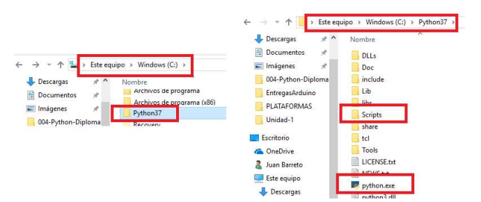

Si damos doble click sobre el ejecutable se nos abrirá una terminal desde la cual ya podemos utilizar python, a modo de ejemplo escribiremos:

```python
Print("Hola Python")
```

Podemos observar cómo nos retorna "Hola".

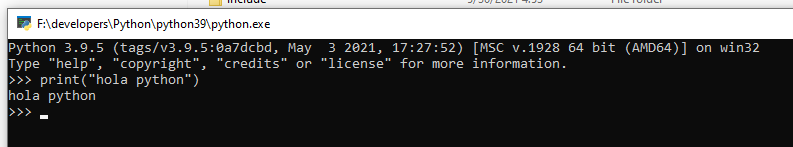

###  Configuración.

En nuestro sistema operativo, podríamos tener instalada cualquier versión de python, incluso todas ellas al mismo tiempo, sin embargo la versión que estaría ejecutandose en el sistema sería aquella que se encontrara agregada en las variables de entorno del usuario que está logueado. Si abrimos el cmd del sistema y escribimos:

```cmd
python
```

Nos saldría un mensaje diciendo que **"python no se reconoce como un comando interno o externo, programa o archivo por lotes ejecutables"** ya que no reconoce que python esté instalado.

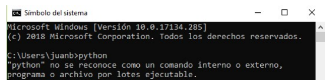

Sin embargo si escribimos:

```cmd
set path=%path%;C:\python37
```

Vemos como ahora podemos escribir python e ingresaríamos a la versión de Python que se encuentra indicada en la ruta resaltada en rojo en la línea de código anterior, pudiendo ahora repetir la linea "print("Hola")" y se comportaría exactamente igual que al haber abierto el ejecutable que se encuentra dentro de la carpeta instalación.

**¿Cómo se agrega de forma permanente una versión de python ?**

Cómo comentamos un poco más arriba, es posible tener varias versiones de python instaladas pero solo hacer accesible una versión desde nuestro sistema operativo, para ello abrimos una carpeta cualquiera en Windows y hacemos click derecho sobre el ícono de "Equipo" y luego seleccionamos "Propiedades". En la nueva ventana seleccionamos "Configuracion avanzada del sistema".

----Tema a seguir trabajando mas adelante ----


### 1.3- Evaluar si la instalación se realizó correctamente.

Para verificar que todo esté funcionando correctamente, abrimos el cmd y tipeamos "python". Si todo está bien debemos ver un mensaje como el siguiente:

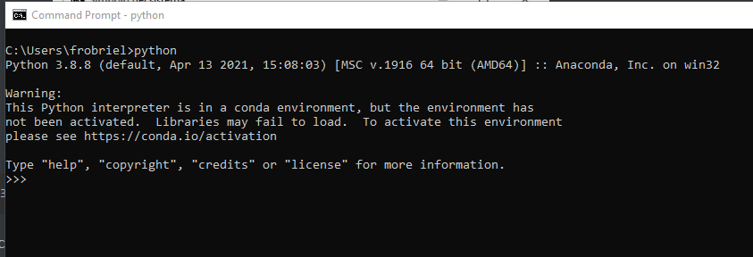


# 2- Herramienta  Útiles.

## 2.1- Uso del IDLE

Dentro de las cosas que se han instalado en nuestra máquina, se encuentra el IDLE (Editor de texto que viene por defecto con cada distribución de python), lo abrimos y debería de presentar una apariencia como de la siguiente imagen:


Mediante el IDLE de python podremos evaluar el correcto funcionamiento de nuestros scripts y obtener un detalle de posibles errores. Como ejemplo podemos realizar nuestro primer "Hola mundo" escribiendo:

```python
print("Hola Mundo")
```

> Notar que:
>
> 1. En el código, no se agrega punto y como al final de print, como en muchos de los programas actuales (php, javascript, ....)
> 2. El IDLE asigna un código de colores, el cual puede ser editable.

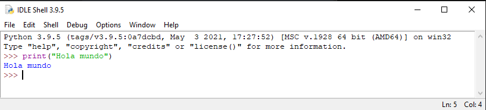

## 2.1.1- Crear y ejecutar script con el IDLE.

Si vamos a File en el margen superior izquierdo del IDLE podemos crear un documento nuevo, al cual podemos salvar con un nombre. Si ahora dentro del archivo generado copiamos nuestro print("Hola Mundo"), guardamos el archivo y vamos a Run > Run Module F5. Se abre otra ventana del IDLE que nos muestra el resultado de la ejecución y de existir errores un mensaje con el detalle de los mismos.

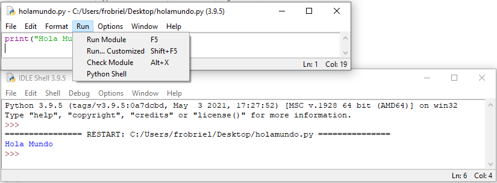

## 2.1.2 Recobrar código en el IDLE

En windows y linux

Alt+P for previous y Alt+N for Next

## 2.1.3 Ejecutar script en Windows desde el cmd.

Cuando queremos ejecutar un script en windows desde el cmd, debemos pararnos en el directorio en el cual se encuentra y escribir `python nombre_Archivo` y este se ejecutará.

Probemos con el ejemplo anterior, yo he guardado en el escritorio el archivo "holamundo.py" el cual contiene la línea de código:

`holamundo.py`

```python
print("Hola Mundo")
```

Para ejecutarlo primero abro el cmd, sabiendo que para ingresar a un directorio lo hago con la palabra "cd" seguida del nombre del directorio y que para ir hacia atrás se utiliza "../". Dado que en mi caso el cmd se abre desde el usuario actual y que el archivo se encuentra en el escritorio, escribo:

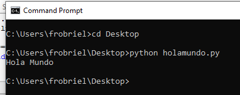

# 3.- Como funciona Python

Python es tanto un lenguaje compilado como interpretado, en el cual:

1. Python compila el código, o sea lo pasa a código de máquina, permitiendo que se ejecute más rápido.
2. El código compilado se presenta con extensión .pyc con la estructura _pycache_subdirectorio. Una vez que se genero el archivo .pyc si no esite modificaciones se ejecutar este archivo en lugar del .py
3. El intérprete luego interpreta el código de byte línea por línea.

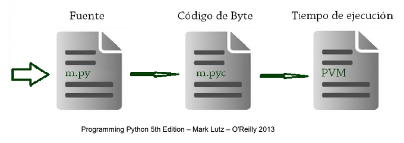

> **Nota 1**: A diferencia de C o C++ el código corre inmediatamente luego de que es escrito, no existe la etapa de construcción.
>
> **Nota 2**: En Python la PVM(Python Virtual Machine), no el chip del CPU es el que realiza el papel del Intérprete por lo que Python no funciona tan rápido como C o C++. Por otro lado Python no re analiza cada línea de código, el efecto es que corre a una velocidad intermedia entre los lenguajes compilados y los interpretados.

# 4.- Variables y comentarios.

## Variable

Una variable se puede considerar como un símbolo que puede ser reemplazado o que toma un valor determinado, como puede ser un valor numérico en una ecuación o expresión matemática en general.

Las variables se puede utilizar para guardar datos de diferentes tipos, por ejemplo: enteros, caractares, listas, arrays, diccionarios, objetos, etc. Todos estos términos seguramente son desconocidos a esta altura, e iremos hablando de ellos en el transcurso de las unidades. De esta forma si queremos hacer que una variable se encuentre relacionada con un valor entero podríamos escribir algo como:

```python
variable1 = 7	
```

En el ejemplo anterior el nombre de la variable es "variable1" y el valor que toma la variable es el entero = 7.

Pero si el 7 lo ponemos entre comillas simples o dobles en este caso la variable 1 estaría relacionada con el caracter "7" o como lo trabajaremos en python el string(alfanumericos) "7".

```python
variable1="7"
```

## Comentarios

En python podemos adicionar a nuestro código comentarios que podemos escribir en una línea anteponiendo el símbolo de numeral "#" o en varias líneas entre comillas triples como se muestra a continuación.

```python
# Esto es un comentario
"""
Hola curso,
Esto tambien es un comentario pero multilínea.
"""
```

# 5.- Asignación dinámica, garbage collection y referencia compartidas.

## 5.1- Asifnación dinámica.

Cada vez que creamos una variable:

1. Se genera un registro en una tabla.
2. Se crea un objeto.
3. Se establece la ruta desde la variable al objeto.

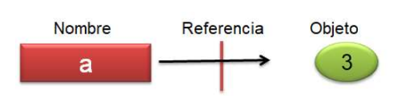

El objeto creado posee:

1. Un indicador de tipo de objeto.
2. Un contador de referencia para establecer cuándo se puede reclamar el objeto.

Ejemplo:

La variable "a" cambia de tipo, de entero a cadena de caractares luego a un número flotante.

```python
a=3         #Es un entero 
a='Manzana' #Ahora es un string
a=1.23      #Ahora es un número flotante
```

En este caso la varialbe no tiene tipo, ya que este es un dato asociado al objero, "a" simplemente está referenciado a diferentes objetos. Lo único que podemos decir de una variable es que ésta hace referencia a un determinado objeto en un determinado espacio de tiempo.

## 5.2- Garbage collection (Cuando se contruye un objeto)

En Python en el momento que un nombre (variable) es asignado a un nuevo objeto, el espacio de memoria ocupado por el nuevo objeto es reclamado si éste no es referenciado por ningún otro nombre u objeto.

```python
x = 42
x = 'Juan'     #Reclama 42
x = 3.1415     #Reclama Juan
x = [1, 2, 3]  #Reclama 3.1415
```

## 5.3 Referencias compartidas.

En este caso ambos nombres de variables, tanto "a" como "b" se encuentran asociados al mismo espacio de memoria.

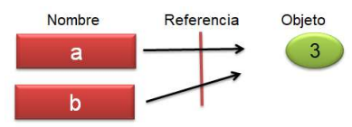

```python
a=3
b=a
```

En python, no hay forma de hacer que una variable haga referencia a otra variable, en lugar de esto la nueva variable, hace referencia al mismo objeto.

Ojo, pues según esto al modificar el valor de a, b siguie haciendo referencia al objeto asignado antes.

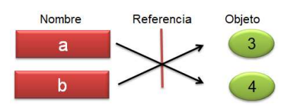

```python
a=3
b=a
a=4
```

A diferencia de otros lenguajes, en Python las variables señalan siempre a objetos, no a espacios de memoria. Al setear una variable con un nuevo valor el objeto original no es alterado, sino que hace referencia a un nuevo objeto.

Con este punto debemos tener especial cuidado y lo desarrollaremos un poco más en la siguiente unidad ya que existen situaciones que nos pueden conducir a un error de interpretación, al trabajar con los tipos de datos "Listas" y "Diccionarios".

La siguiente tabla representa algunos de los tipos de objetos que comenzaremos a analizar, debemos prestar especial atención a la primera columna en donde se indica si el objeto es inmutable o no. En la siguiente unidad desarrollaremos este tema, hasta aquí solo diremos que lo dicho antes se cumple para objetos del tipo inmutables.

| Inmutable / No Inmutable | Tipos de Objetos | Ejemplo                                         |
| ------------------------ | ---------------- | ----------------------------------------------- |
| Inmutable                | Números          | 1234, 3.14, 3+4j, 0b111, Decimal()              |
| Inmutable                | Strings          | 'Pera', b'a\x01c'                               |
| No Inmutable             | Listas           | [1,['tres','dos']], list(range(10))             |
| No Inmutable             | Diccionarios     | {'nombre': 'Pedro', 'edad':23,}, dict(horas=10) |
|                          | Archivos         | open('archivo.txt')                             |
| No Inmutable             | Sets             | set('abc'), {'a','b','c'}                       |
|                          | Otros            | Booleans, types, None                           |

# 6- GUI

Trabajar con el CMD puede ser muy útil en muchas ocasiones pero muy aburrido, por lo que vamos a introducir una interfaz gráfica llamda "Tkinter" la cual nos va a permitir crear aplicaciones de escritorio en Linux, Mac y Windows.

## 6.1- Primera aproximación - ejemplo1.py.

Comencemos por realizar un hola mundo para comprender un poco el funcionamiento. Lo primero que tenemos que hacer es incorporar la plataforma para lo cual incluiremos como primer línea la llamada librería :

```python
from tkinter import *
```

