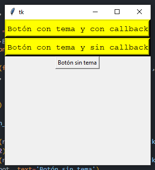
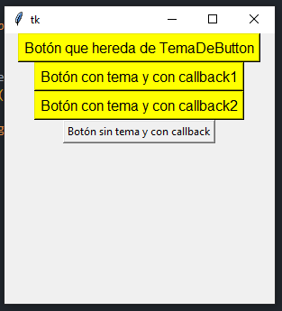
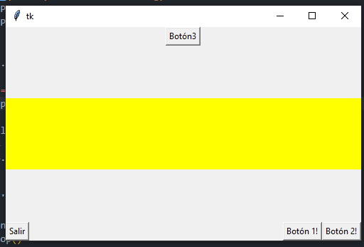

# Unidad IV – POO - Programación Orientada a Objetos II

Tematicas (https://www.youtube.com/watch?v=nQGYJbqOo2M)

1. **Variables y métodos de instancia, de clase, estáticos.**
2. **Ejemplo 1**
3. **Personalizar widgets con clases.**
4. **Personalizar temas - poo-Temas.**
5. **Crear contenedores reutilizables -poo-Frame.**

**1- Variables y métodos de instancia, de clase, estaticos.**

Vamos a ver ahora algunas clasificaciones de las variables y métodos que utilizamos dentro de una clase.

**Variables y método de instancia**

Las variables de instancia son aquellas que utilizamos para establecer las caracteristicas de un determinado objeto, como puede ser el color de ojos en una persona, su altura, peso, etc. Estas variables siempre van precedidas de la palabra reservada "self", la cual debe ser especificada dentro de todo método que vayamos a utilizar. Todos los métodos que utilicen una variable de instancia(métodos de instancia) deben poseer la declaración de "self" como primer parámetro entre paréntesis. En el siguiente ejemplo:

**uso_de_self.py**

```python
class Persona(object):
	def __init__(self, nombre, edad, sexo):
		self.nombre = nombre
		self.edad = edad
		self.sexo = sexo
		print(self.nombre)
		
	def datos(self, salario):
		print("Nombre de la persona:"+ self.nombre + "\n" + "Salario en $:" + str(salario))
        
objeto = Persona("Juan", 39, "masculino")

objeto.datos(100)
```

Vemos que el constructor permite establecer tres variables de instancia(nombre, edad y sexo) las cuales son asignadas mediante:

```python
self.nombre = nombre
self.edad = edad
self.sexo = sexo
```

El método de instancia datos() tiene como primer componente la palabra self(la que nos permite utilizar dentro del mismo la variable de instancia self.nombre)

```python
def datos(self, salario):
```

y como segundo componente un atributo (salario) que debe ser pasado por la invocación del método a partir del objeto instanciado.

```python
objeto.datos(100)
```

**Variables de clase**

Las variables de clase no están asociadas a una instancia en particular, sino directamente a la clase, es correcto declararlas inmediatamente después del establecimiento del nombre de la clase. En el ejemplo dado a continuación la variable "empresa" puede ser invocada tanto a partir de una instancia:

```python
print(objeto.empresa)
```

Como directamente a partir de la clase:

**variables_de_clase.py**

```python
class Persona(object):
    empresa = "Empresa1"
    def __init__(self, nombre, edad, sexo):
        self.nombre = nombre
        self.edad = edad
        self.sexo = sexo
        print(self.nombre)
        
	def datos(self, salario):
        print("Nombre de la persona: "+ self.nombre + "\n" + "Salario en $:" + str(salario))
        
objeto = Persona("Juan", 39, "masculino")
objeto.datos(100)
print(Persona.empresa)
print(objeto.empresa)
print(objeto.edad)
```

**Métodos de clase - decorador: @classmethod**

Los métodos de clase, es decir aquellos que no necesitan de la instancia de un objeto pueden ser invocados directamente escribiendo el nombre de la clase y a continuación con notación de punto, el nombre del método y los atributos que toma.

Los métodos de clase utilizan en su devlaración un primer parámetro "cls" de forma análoga a como declaramos en un método de instancia la palabra "self", y deben de ser precedidos por el decorador @classmethod(existen otros decoradores que veremos más adelante). Veamos un ejemplo:

**metodos_de_clase.py**

```python
class Persona(object):
    
    @classmethod
    def imprimir(cls, parametro1):
        print(parametro1)
        
Persona.imprimir("valor del parametro 1")        
```


**Métodos estáticos - decorador: @staticmethod**

Los  métodos estáticos, no necesitan poseer referencia a ningún argumento (como self o cls) pero si deben llevar previamente el decorador @staticmethod. Dato que no poseen en su declaración la palabra "self", no es posible acceder desde ellos a una variable de instancia.

**metodos_estaticos.py**

```python
class Persona(object):
    
    @staticmethod
    def imprimir(parametro1):
        print(parametro1)
        
objeto = Persona()
objeto.imprimir("valor del parámetro 1")
```


## **Ejemplo 1.**

Comencemos a crear un ejercicio que nos permita integrar los conocimientos aprendidos y aprender nuevos sobre la marcha. Lo realizaremos de a pasos para avanzar de a poco.

**Paso 1 - Crear clase poo01.**

Como primer paso, creamos una clase para manejar nuestros datos y la ubicamos dentro de un directorio según el siguiente esquema:

```bash
datosiniciop
	-> personam.py
```

Las clase posee un contructor ``__init__`` y una palabra "self" que hace referencia al objeto en particular  con el cual estamos trabajando(es el this de otros lenguajes como JAVA, javaScript, PHP, etc).

**poo01/datosiniciop/personam.py**

```python
class Persona:
    def __init__(self, nombre, edad, sueldo=0, trabajo=Nome):
        self.nombre = nombre
        self.edad = edad
        self.sueldo = sueldo
        self.trabajo = trabajo
        
if __name__ == '__main__':
    Juan = Persona('Juan Garcia', 42, 30000, 'software')
    Susana = Persona('Susana Gomez', 45, 40000,'hardware')
	print(Juan.nombre,Susana.sueldo)
    print(Juan.nombre.split()[-1])
	Susana.sueldo *=1.10
	print(Susana.sueldo)
```

Como podemos observar la instancia del objeto la realizamos sin la necesidad de la "new"utilizada en otros lenguajes y pasandole los parametros que especifica el constructor:

``Juan = Persona('Juan Garcia', 42, 30000, 'software')``

De estaforma es posible acceder a modificar un atributo del objeto mediante notación de punto simplemente como:

```python
Susana.sueldo *= 1.10
```

**Paso 2 - Accedemos desde archivo externo. poo02**

Nuestro esquema queda modificado de la siguiente forma:

```bash
datosiniciop
	personam.py
creardb.py
```

Notar en el siguiente código como creamos dos objetos de la clase Persona y almacenamos datos en forma de listas. La primera lista la creamos mediante un bucle for, y las siguientes dos listas mediantes compresión.

``poo02 /creardb.py``

```python
if __name__ == '__main__':
    from datosiniciop.personam import Persona
    
    Juan = Persona('Juan Garcia', 42)
    Susana = Persona('Susana Gomez', 45, 40000)
    
    persona = [Juan, Susana]
    for persona in persona:
        print(persona.nombre, persona.sueldo)
	print('-----------------------------')
    
#############################################
#Por compresión
#############################################
x = [(persona.nombre, persona.sueldo) for persona in personas]
print(x)
print('-----------------------------')

y = [(persona.edad ** 2 if persona.edad >= 7 else persona.edad) for persona in personas]
print(y)
print('-----------------------------')
```


**Paso 3 - Creamos métodos de clase. poo02**

En el archivo personam.py hermos creado dos instancias de la clase persona, accediendo a una parte del nombre del objeto Juan, y modificado el sueldo del objeto Susana, desde fuera de la clase. Podemos optimizar el código de la clase con este fin agregando los métodos "apellido" y "dar_aumento".

Notar, que es necesario pasarle a los métodos como argunmento la palabra "self" para poder trabajar con los atributos de la clase.

Notar tambien que hemos agregado un parámetro "porcentaje" al metodo "dar_aumento" el cual es introducido directamente mediante la llamada a dicho método.

``poo03/datosIniciop/personam.py``

```python
class Persona:
    def __init__(self, nombre, edad, sueldo=0, trabajo=Nome):
        self.nombre = nombre
        self.edad = edad
        self.sueldo = sueldo
        self.trabajo = trabajo
        
	def apellido(self):
        return self.nombre.split()[-1]
    
    def dar_aumento(self, porcentaje)
    	self.sueldo *= (1.0 + porcentaje)
        
if __name__ = '__main__'
	Juan = Persona('Juan Garcia', 42, 30000, 'software')
    Susana = Persona('Susana Gomez', 45, 40000, 'hardware')
    print(Juan.nombre, Susana.sueldo)
    print(Juan.apellido())
    Susana.darAumento(0.10)
    print(Susana.sueldo)
```

**Paso 4 - Herencia de clase. poo04**

Python a diferencia de lenguajes como JAVA y PHP permire la incorporacion de herencia multiples, las clases padre son declaradas en las clases hijas entre paréntesis a continuación del nombre de clase. Para ver cómo funciona el uso de herencia, introduzcamos una clase (Gerente), la cual introduce una modificacion en el método darAumento agregándole un premio extra al porcentaje de aumento estipulado desde el objeto instancia. Nuestro esquema ahora queda como sigue:

```bash
datosInicioP
	__pycache__
	personam.py
	gerentem.py
crearDb.py
```

``poo04/datosiniciop/gerentem.py``

```python
from personam import Persona

class Gerente(Persona)

	def dar_aumento(self, porcentaje, premio=0.1):
        self.sueldo *= (1.0 + porcentaje + premio)
        
if __name__ == '__main__':
    
    Tom = Gerente('Tom Peres', 42, 50000, 'software')
    print(Tom.nombre)
    Tom.dar_aumento(0.10,0.40)
    print(Tom.sueldo)
```

Notar como aquí se hace una asignación por defecto del valor correpondiente a premio por lo que es posible escribir la asignación de monto de las siguientes formas dependiendo si dejamos el monto del premio con el valor por defecto, o si lo modificamos desde afuera respectivamente:

```bash
Tom.dar_aumento(0.10)
Tom.dar_aumenteo(0.10, 0.40)
```

**Paso 5 - Analizar desde donde llamó a un módulo.**

**OJO:** No puedo hacer referencia desde creadb.py a Gerente con el código escrito de esta forma ya que no encontraría la referencia a la clase Persona desde la clase Gerente simplemente porque al llamar la clase gerente desde fuera del paquete, se esperaría que en Gerente la importación de la clase "Përsona" fuera:

```python
from datosiniciop.personam import Persona
```

y no:

```python
from personam import Persona
```

**Paso 6 - Separación del código poo-05**

Una forma más conveniente de trabajar, es separar el código de cada clase y ubicar cada una en un directorio diferente según el siguiente esquema:

```python
personap
	__pycache__
	personam.py
gerentp
	__pycache__
	gerentem.py
crearDb.py
```

En este punto nuestos códigos quedarían como sigue:

``poo06/personap/personam.py``

```python
class Persona:
    def __init__(self, nombre, edad, sueldo=0, trabajo=Nome):
        self.nombre = nombre
        self.edad = edad 
        self.sueldo = sueldo
        self.trabajo = trabajo
        
	def apellido(self):
        return self.nombre.split()[-1]

    def dar_aumento(self, porcentaje):
        self.sueldo *= (1.0 + porcentaje)
        
 if __name__ == '__main__':
    Juan = Persona('Juan Garcia', 42, 30000, 'software')
    Susana = Persona('Susana Gomez', 45, 40000, 'hardware')
	print(Juan.nombre, Susana.sueldo)
    print(Juan.apellido())
    Susana.dar_aumento(0.10)
    print(Susana.sueldo)  
```

``poo06/gerentep/gerentem.py``

```python
from personap.personam import Persona

class Gerente(Persona):
    
    def dar_aumento(self, porcentaje, premio=0.1):
        self.sueldo *= (1.0 + porcentaje + premio)         

```

``poo06/creardb.py``

```python
if __name__ == '__main__'
	from personap.personam import Persona
    from gerentep.gerentem import Gerente
    Juan = Persona('Juan Garcia', 42)
    Susana = Persona('Susana Gomez', 45, 40000)
    Tom = Gerente('Tom Perez', 42, 50000, 'software')
    db = [Juan, Susana, Tom]
    
    for persona in db:
        print(persona.nombre, persona.sueldo)
	print('--------------------')
    
    for objeto in db:
        objeto.dar_aumento(0.10)
        
	for objeto in db:
        print(objeto.nombre, '=>', objeto.sueldo)
	print('--------------------')
    
    for objeto in db:
        print(objeto.apellido(), '=>', objeto.sueldo)
	print('--------------------')        
```

**Paso 7 - Uso de ``__str__`` e instancia a través de constructor de clase padre poo07**

En esta sección se han realizado dos modificaciones, la primera es la incorporación del método ``__str__`` en la clase Persona. Este al igual que todos los que comienzan y terminan con dos guiones bajos, es reservado de Python y lo que nos permite es retornar los valores de los atributos de un objeto en un formato string, cada vez que realizamos un print del objeto.

La otra modificación introducida, es que se ha agregado a la clase Gerente un constructor, y dentro de este se llama al constructor de la clase padre, con lo cual el objeto constructor de Gerente únicamente solicita aquellos datos que son propios de los objetos de la clase, y se pasan como parámetros al constructor de la padre ( Persona ) los valores propios de la clase hija (Gerente) y el valor de puesto de trabajo es declarado como por defecto en "Gerente" en el constructor de la clase Gerente.

``poo07/personap/personam.py``

```python
class Persona:
    .............
    
    def __str__(self):
        return('<%s => %s: %s, %s>'%(self.__class__.__name__, self.nombre, self.trabajo, self.sueldo))
```

``poo07/gerenteP/gerentem.py``

```python
from personap.personam import Persona

class Gerente(Persona):
    
    def __init__(self, nombre, edad, sueldo):
        Persona.__init__(self, nombre, edad, sueldo, 'Gerente')
        
	def dar_aumento(self, porcentaje, premio=0.1):
        Persona.dar_aumento(self, porcentaje + premio)
        
if __name__ == '__main__':
    #############################################################
    # Para llamada a __str__
    #############################################################
    print('----------__str__----------')
    print(Juan)
    print(Susana)
    print('--------------------')
```

**Paso 8 - Persistencia de datos -- poo8.** 

Ahora es hora de persistir los datos, para lo que podemos utilizar alguna de las bases de datos vistas hasta aquí, Recordemos como realizarlo con sherve.

***Crear archivo de bytes de base de datos.***

``poo8/guardardatos.py``

```python
import shelve
from personap.personam import Persona
from gerentep.gerentem import Gerente

Juan = Persona('Juan Garcia', 42)
Susana = Persona('Susana Gomez', 45, 40000)
Tom = Gerente('Tom Perez', 42, 50000)

db = shelve.open('persona')
db['Juan'] = Juan
db['Susana'] = Susana
db['Tom'] = Tom 
db.close()
```

***Leer desde "persona" - leerdesdepersona.py .***

`` poo08/leerdepersona.py``

```python
import shelve
db = shelve.open('persona')
for key in db:
    print(key, '=>\n', db[key].nombre, db[key].sueldo)
    
Juan = db['Juan']
print(Juan.apellido())
print(Juan.apellido())
print(db'[Susana]'.apellido())
db.close()
```

***Actualizar datos - actualizardatos.py .***

`` poo08/actualizardatos.py``

```python
import shelve
from personap.personam import Persona
from gerentep.gerentem import Gerente

Juan = Persona('Juan Garcia', 42)
Susana = Persona('Susana Gomez', 45, 40000)
Tom = Gerente('Tom Perez', 42, 50000)

db = shelve.open('persona')
Tom = db['Tom']
Tom.dar_aumento(0.20)
db['Tom'] = Tom
db.cloe()
```

**3. Personalizar widgets con clases.**

Podemos utilizar la POO para personalizar el código y re utilizarlo mediante la herencia de clases. Consideremos el siguiente código, en el cual se ha creado una clase que hereda a la clase Button de tkinter. El botón creado a partir de la clase HolaButton ahora tiene asociada una funcion callback que lo que hace es imprimir la palabra "Adios" cada vez que se presiona el botón. La clase HolaButton admite que le pasemos parámetros externos al botón a través de **config.

``poo_botones/boton1.py``

```python
from tkinter import *

class HolaButton():
    def __init__(self, parent=None, **config):
        
        self.myParent = parent
        self.myParent.geometry("300x300")
        button = Button(self.myParent, **config)
        button.pack(side=LEFT)
        button.config(command=self.callback)
        
	def callback(self):
        print('Adios...')
        self.myParent.quit()
        
if __name__ == '__main__':
    root = Tk()
    miaplicacion = HolaButton(root, text = 'Hello subclass world')
    root.mainloop()
```

Ahora podriamos crear una clase "MiButto" que herede "HolaButton" que permita modificar la función callback:

``poobotones/boton2.py``

```python
from tkinter import *
from boton1 import HolaButton

class MiButton(HolaButton):
    def callback(self):
        print("Texto modificado !...")
        
if __name__ == '__main__':
    root = Tk()
    root.geometry("300x200")
    MiButton(root, text='Botón de subclase')
    root.mainloop()    
```

**4. Personalizar temas  - POO-TEMAS.**

Una aplicación que podría resultar interesante, es utilizar la herencia de clases para establecer diferentes temas. En el código siguiente se crea una nueva clase "TemaDeButton" en la cual se añade estilos al botón generado a partir de ella.

Notar como la funcion callback1 que imprime un texto en pantalla es pasada como el parametro del boton "B1", mientras que el boton "B2" que aplica los mismos temas, no poseee una función callback asociada.

Finalmente el botón "B3" no presenta estilos, ya que hereda directamente de HolaButton, pero si tiene función callback asociada ya que esta fue definida dentro de la clase.

``pootemas/boton3.py``

```python
from tkinter import *
from boton1 import HolaButton


class TemaDeButton():
    def __init__(self, parent=None, **configs):

        self.myParent = parent
        self.myParent.geometry("300x300")
        button = Button(self.myParent, **configs)
        button.pack()
        button.config(fg='black', bg='yellow', font=('courier', 12),
        relief=RAISED, bd=5)

def callback2():
    print('callback2')

if __name__ == '__main__':
    root = Tk()
    B1 = TemaDeButton(root, text='Botón con tema y con callback',
    command= callback2)
    B2 = TemaDeButton(root, text='Botón con tema y sin callback')
    B3 = HolaButton(root, text='Botón sin tema')

    root.mainloop()
```

Al ejecutar el código anterior, tendríamos que poder ver lo siguiente en pantalla:



Ahora podríamos crear un botón que herede de la clase que aplica el tema, y además especificar los parámetros del tema en un archivo aparte de forma de hacer la personalización accesible al usuario.

``pootemas/boton4.py``

```python
from tkinter import *
from parametrostema import bcolor, bfont, bsize
from boton1 import HolaButton


class TemaDeButton:
    def __init__(self, parent=None, **configs):

        self.myParent = parent
        self.myParent.geometry("300x300")
        button = Button(self.myParent, **configs)
        button.pack()
        button.config(bg=bcolor, font=(bfont, bsize))


def callback1():
    print("callback1")


def callback2():
    print("callback2")


class MiButton(TemaDeButton):
    def __init__(self, parent=None, **configs):
        TemaDeButton.__init__(self, parent, **configs)


if __name__ == "__main__":
    root = Tk()
    B1 = MiButton(root, text="Botón que hereda de TemaDeButton", command=callback2)
    B2 = TemaDeButton(root, text="Botón con tema y con callback1", command=callback1)
    B3 = TemaDeButton(root, text="Botón con tema y con callback2", command=callback2)
    B4 = HolaButton(root, text="Botón sin tema y con callback")
    root.mainloop()

```

``pootemas/parametrostema.py``

```python
bcolor = 'yellow'
bfont  = 'Arial'
bsize  = 12
```

Muestra esta salida ahora se vería así:



5. Crear contenedores reutilizables - poo-Frame.

Podemos crear también contenedores reutilizables, lo cual es altamente recomendable en grandes aplicaciones, el script consta de una clase que toma un fram y le agrega dos botones. Notar que los botones son agregados como funciones.

``pooframe/frame1.py``

```python
from tkinter import *


class Hola(Frame):
    def __init__(self, parent=None):
        Frame.__init__(self, parent)
        self.pack()
        self.data = 0
        self.agregar_boton1()
        self.agregar_boton2()

    def agregar_boton1(self):
        widget = Button(self, text="Botón 1!", command=self.valor_de_variable)
        widget.pack(side=LEFT)

    def agregar_boton2(self):
        widget = Button(self, text="Botón 2!", command=self.valor_de_variable)
        widget.pack(side=LEFT)

    def valor_de_variable(self):
        self.data += 1
        print("Valor %s!" % self.data)


if __name__ == "__main__":
    Hola().mainloop()
```

**Nota:** Ambos botones pertenecientes al contenedor al tener acceso a la variable de instancia, recuerdan el valor que esta tiene.

Ahora podemos reutilizar el código en otra aplicación, como se muestra a continuación.

``pooframe/frame2.py``

```python
from sys import exit
from tkinter import *
from frame1 import Hola

root = Tk()
root.geometry("400x200")
parent = Frame(root, bg="yellow", width=300, height=100)
parent.pack(expand=YES, fill=X)
Hola(parent).pack(side=RIGHT)
Button(parent, text='Agregado', command=exit).pack(side=LEFT)
root.mainloop()
```

Utilizando una programacion orientada a objetos, no tendríamos que tener problemas para comprender el siguiente código.

``pooframe/frame3.py``

```python
from tkinter import *
from frame1 import Hola


class HolaApp(Frame):
    def __init__(self, parent=None, **config):
        self.myParent = parent
        self.myParent.geometry("500x300")

        button3 = Button(self.myParent, text='Botón3')
        button3.pack()

        parent = Frame(self.myParent, bg="yellow", width=300, height=100)
        parent.pack(expand=YES, fill=X)

        Hola(self.myParent).pack(side=RIGHT)
        button4 = Button(self.myParent, text='Salir', command=exit)
        button4.pack(side=LEFT)


if __name__ == '__main__':
    root = Tk()
    miAplicacion = HolaApp(root, text='Hello subclass world')
    root.mainloop()
```





Bibliografía utilizada y sugerida    
Programming Python 5th Edition – Mark Lutz – O'Reilly 2013  
Programming Python 4th Edition – Mark Lutz – O'Reilly 2011  
https://docs.python.org/3.7/tutorial/ 
https://docs.python.org/3.7/library/index.html
