Unidad IV – POO - Programación Orientada a Objetos II

___


[TOC]


## ***1. Modulo tkinter.***

Antes de comenzar a diseñar la lógica de nuestra aplicación, debemos realizar el diseño de la misma, lo que se suele llamar "look and fell" o apariencia. Dado que estamos aprendiendo cómo posicionar los objestos en la pantalla, la aplicación que crearemos tiene esta finalidad, y la iremos diseñando paso a paso. Está basada en un ejemplo que vi hace ya algún tiempo en internet y sinceramente no recuerdo donde, pero me gusto la forma en la cual la persona que realizó la publicación presentada un ejemplo totalmente didáctico , en donde se podía visualizar las diferentes opciones de posicionamiento de frames, directamente de la selección de opciones en pantalla.

Recordemos que la unidad anterior que la apliación tkinter viene por defecto con la instalción de python y que la forma de cargarlo para no tenes que importar todo su contenido lo realizamos mediante:

```python
from tkinter import *
```

También tenemos en cuenta que la siguiente aplicación la vamos a realizar mediante la implementación de una sola ventana, el código de prueba que vamos a utilizar es el siguiente:

```python
if __name__ == '__main__'
	root = Tk()
    MiApp(root)
    root.mainloop()
```

2. Uso de POO - Diseño y estructura de una aplicacíon.

## ***Paso 1: Elemento raíz - estructura1.py.***

Lo primero que haremos será agregar una ventana principal, de forma análoga a como venimos realizando hasta ahora.

``estructura1.py``

```python
from tkinter import *


class MiApp:
    def __init__(self, parent=None, **configs):

        # ##################################################################
        # Ventana principal
        # ##################################################################
        self.my_parent = parent
        self.my_parent.geometry("700x600")


if __name__ == "__main__":
    root = Tk()
    MiApp(root)
    root.mainloop()
```

La visualización de la ejecucion de este script solo nos permite ver una pantall de fondo gris claro de 700px por 600px según se muestra a continuación.

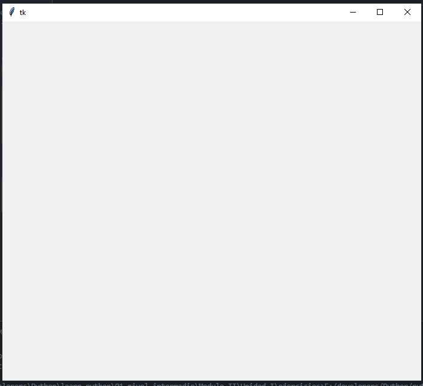

## ***Paso 2: Contenedor - estructura2.py***

Una vez creada la pantalla principal, podemos agregar un elemento contenedor de nuestra aplicación, en donde iremos ubicando los diferentes frames.

``estructura2.py``

```python
from tkinter import *

class MiApp:
    def __init__(self, parent=None, **configs):

        # ##################################################################
        # Ventana principal
        # ##################################################################
        self.my_parent = parent
        self.my_parent.geometry("700x600")

        # ##################################################################
        # Agrego contenedor
        # ##################################################################
        self.contenedor = Frame(self.my_parent, bg="#444")
        self.contenedor.pack(expand=YES, fill=BOTH)


if __name__ == "__main__":
    root = Tk()
    MiApp(root)
    root.mainloop()
```

Al considerar: 

```python
expand = YES, fill BOTH
```

Estamos haciendo que el frame (algo así como un div en código html) se expanda tanto en la dirección X como en la Y.

De aquí en adelante y para simplificar la lectura escribiremos sólo la parte del código que se agrega a la aplicación, de esta forma el código anterior queda:

``estructura2.py``

```python
from tkinter import *

class MiApp:
    -----------------------

    # ##################################################################
    # Agrego contenedor
    # ##################################################################
    self.contenedor = Frame(self.my_parent, bg="#444")
    self.contenedor.pack(expand=YES, fill=BOTH)
    
```

La representación gráfica nos queda:

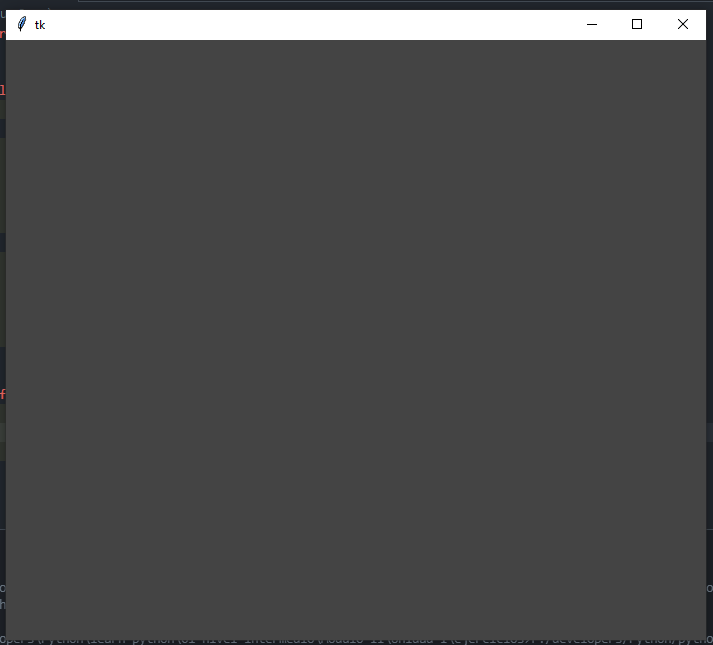

## ***Paso 3: Secciones principales - estructura3.py***

La aplicación se encuentra dividida en tres secciones:

1. Sección de cerrar aplicación.
2. Sección de controles.
3. Seccion de representación gráfica.

``estructura3.py``

```python
from tkinter import *


class MiApp:
    def __init__(self, parent=None, **configs):

        # ##################################################################
        # Ventana principal
        # ##################################################################
        self.my_parent = parent
        self.my_parent.geometry("700x600")

        # ##################################################################
        # Agrego contenedor
        # ##################################################################
        self.contenedor = Frame(self.my_parent, bg="#444")
        self.contenedor.pack(expand=YES, fill=BOTH)
        # ##################################################################
        # Agrego Secciones Principales
        # ##################################################################
        #####  CERRAR #####
        self.seccion_cerrar = Frame(
            self.contenedor, bg="#FF7F50", height=22, borderwidth=2, relief=RAISED
        )
        self.seccion_cerrar.pack(side=TOP, expand=NO, fill=X, padx=7)
        self.cerrar = Frame(self.seccion_cerrar, bg="#222", height=22)
        self.cerrar.pack(side=TOP, expand=NO, fill=X)

        #####  SECCIÓN CONTROLES #####
        self.seccion_controles = Frame(
            self.contenedor, bg="red", borderwidth=2, relief=RAISED
        )
        self.seccion_controles.pack(side=TOP, expand=NO, fill=BOTH, padx=7, pady=7)
        titulo_controles = "Controles"
        Label(
            self.seccion_controles,
            text=titulo_controles,
            bg="#222",
            fg="OrangeRed",
            justify=LEFT,
        ).pack(side=TOP, expand=NO, fill=X, anchor=W)
        self.controles = Frame(self.seccion_controles, bg="#222")
        self.controles.pack(side=TOP, expand=NO, fill=X)

        #####  SECCIÓN REPRESENTACIÓN #####
        self.seccion_representacion = Frame(
            self.contenedor, bg="red", borderwidth=2, relief=RAISED
        )
        self.seccion_representacion.pack(
            side=BOTTOM, expand=YES, fill=BOTH, padx=7, pady=7
        )
        titulo_grafico = "Representación gráfica"
        Label(
            self.seccion_representacion,
            text=titulo_grafico,
            bg="#222",
            fg="OrangeRed",
            justify=LEFT,
        ).pack(side=TOP, expand=NO, fill=X, anchor=W)
        self.representacion = Frame(self.seccion_representacion, bg="OrangeRed")
        self.representacion.pack(side=TOP, expand=YES, fill=BOTH)


if __name__ == "__main__":
    root = Tk()
    MiApp(root)
    root.mainloop()
```

La representación gráfica nos queda:

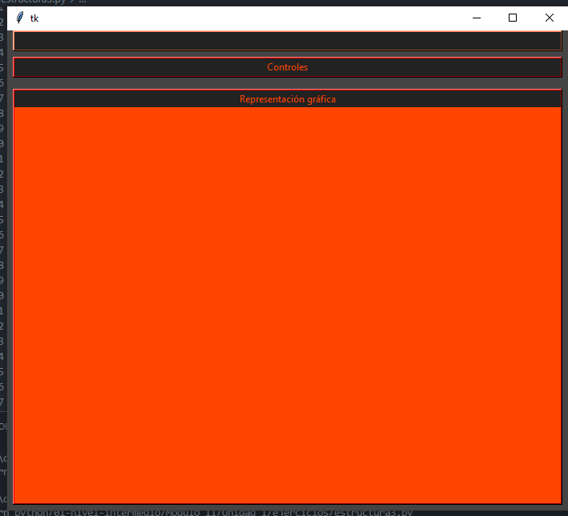

## ***Paso 4: Secciones de controles - estructura4.py***

Dentro de la sección de controles, vamos ahora a ubicar seir contenedores y dentro de cada uno un texto. Estas secciones representaran el título de cada grupo de opciones que luego pondremos dentro.

``estructura4.py``

```python
from tkinter import *


class MiApp:
    def __init__(self, parent=None, **configs):

        # ##################################################################
        # Ventana principal
        # ##################################################################
        self.my_parent = parent
        self.my_parent.geometry("700x600")

        # ##################################################################
        # Agrego contenedor
        # ##################################################################
        self.contenedor = Frame(self.my_parent, bg="#444")
        self.contenedor.pack(expand=YES, fill=BOTH)
        # ##################################################################
        # Agrego Secciones Principales
        # ##################################################################
        #####  CERRAR #####
        self.seccion_cerrar = Frame(
            self.contenedor, bg="#FF7F50", height=22, borderwidth=2, relief=RAISED
        )
        self.seccion_cerrar.pack(side=TOP, expand=NO, fill=X, padx=7)
        self.cerrar = Frame(self.seccion_cerrar, bg="#222", height=22)
        self.cerrar.pack(side=TOP, expand=NO, fill=X)

        #####  SECCIÓN CONTROLES #####
        self.seccion_controles = Frame(
            self.contenedor, bg="red", borderwidth=2, relief=RAISED
        )
        self.seccion_controles.pack(side=TOP, expand=NO, fill=BOTH, padx=7, pady=7)
        titulo_controles = "Controles"
        Label(
            self.seccion_controles,
            text=titulo_controles,
            bg="#222",
            fg="OrangeRed",
            justify=LEFT,
        ).pack(side=TOP, expand=NO, fill=X, anchor=W)
        self.controles = Frame(self.seccion_controles, bg="#222")
        self.controles.pack(side=TOP, expand=NO, fill=X)

        #####  SECCIÓN REPRESENTACIÓN #####
        self.seccion_representacion = Frame(
            self.contenedor, bg="red", borderwidth=2, relief=RAISED
        )
        self.seccion_representacion.pack(
            side=BOTTOM, expand=YES, fill=BOTH, padx=7, pady=7
        )
        titulo_grafico = "Representación gráfica"
        Label(
            self.seccion_representacion,
            text=titulo_grafico,
            bg="#222",
            fg="OrangeRed",
            justify=LEFT,
        ).pack(side=TOP, expand=NO, fill=X, anchor=W)
        self.representacion = Frame(self.seccion_representacion, bg="OrangeRed")
        self.representacion.pack(side=TOP, expand=YES, fill=BOTH)
        # ##################################################################
        # Controles
        # ##################################################################
        self.temas_opciones = Frame(self.controles, borderwidth=5, bg="#222")
        self.nombres_opciones = Frame(self.controles, borderwidth=5, bg="#222")
        self.side_contenedor = Frame(self.controles, borderwidth=5, bg="#222")
        self.fill_contenedor = Frame(self.controles, borderwidth=5, bg="#222")
        self.expand_contenedor = Frame(self.controles, borderwidth=5, bg="#222")
        self.anchor_contenedor = Frame(self.controles, borderwidth=5, bg="#222")

        self.temas_opciones.pack(side=LEFT, expand=NO, fill=Y, anchor=N)
        self.nombres_opciones.pack(side=LEFT, expand=YES, fill=Y, anchor=N)
        self.side_contenedor.pack(side=LEFT, expand=YES, anchor=N)
        self.fill_contenedor.pack(side=LEFT, expand=YES, anchor=N)
        self.expand_contenedor.pack(side=LEFT, expand=YES, anchor=N)
        self.anchor_contenedor.pack(side=LEFT, expand=YES, anchor=N)

        Label(
            self.temas_opciones,
            borderwidth=4,
            relief=RAISED,
            text="Temas",
            bg="#222",
            fg="OrangeRed",
        ).pack(fill=X)
        Label(
            self.nombres_opciones,
            borderwidth=4,
            relief=RAISED,
            text="Opciones",
            bg="#222",
            fg="OrangeRed",
        ).pack(fill=X)
        Label(
            self.side_contenedor,
            borderwidth=4,
            relief=RAISED,
            text="Side",
            bg="#222",
            fg="OrangeRed",
        ).pack(fill=X)
        Label(
            self.fill_contenedor,
            borderwidth=4,
            relief=RAISED,
            text="Fill",
            bg="#222",
            fg="OrangeRed",
        ).pack(fill=X)
        Label(
            self.expand_contenedor,
            borderwidth=4,
            relief=RAISED,
            text="Expand",
            bg="#222",
            fg="OrangeRed",
        ).pack(fill=X)
        Label(
            self.anchor_contenedor,
            borderwidth=4,
            relief=RAISED,
            text="Anchor",
            bg="#222",
            fg="OrangeRed",
        ).pack(fill=X)


if __name__ == "__main__":
    root = Tk()
    MiApp(root)
    root.mainloop()
```

La representación gráfica nos queda:

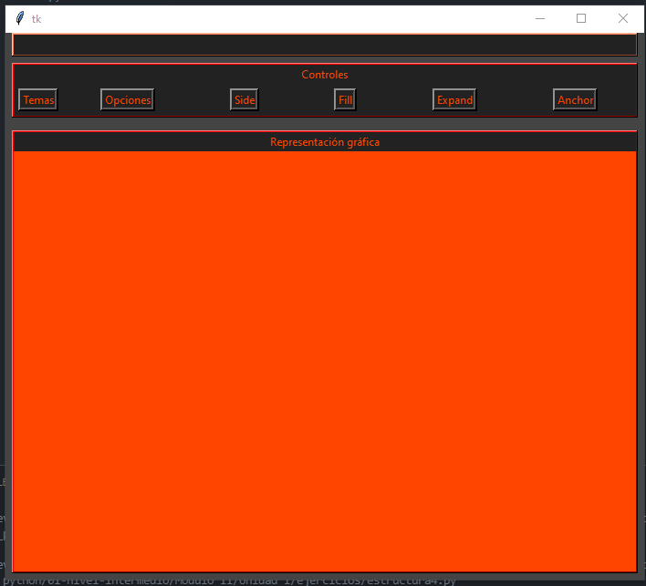

## ***Paso 5: Secciones de representación - estructura5.py***

Haremos ahora algo similar al paso anterior, pero con la sección representación, en donde ubicaremos tres frames que contendrán nuestra representacion gráfica.

```python
from tkinter import *


class MiApp:
    def __init__(self, parent=None, **configs):

        # ##################################################################
        # Ventana principal
        # ##################################################################
        self.my_parent = parent
        self.my_parent.geometry("700x600")

        # ##################################################################
        # Agrego contenedor
        # ##################################################################
        self.contenedor = Frame(self.my_parent, bg="#444")
        self.contenedor.pack(expand=YES, fill=BOTH)
        # ##################################################################
        # Agrego Secciones Principales
        # ##################################################################
        #####  CERRAR #####
        self.seccion_cerrar = Frame(
            self.contenedor, bg="#FF7F50", height=22, borderwidth=2, relief=RAISED
        )
        self.seccion_cerrar.pack(side=TOP, expand=NO, fill=X, padx=7)
        self.cerrar = Frame(self.seccion_cerrar, bg="#222", height=22)
        self.cerrar.pack(side=TOP, expand=NO, fill=X)

        #####  SECCIÓN CONTROLES #####
        self.seccion_controles = Frame(
            self.contenedor, bg="red", borderwidth=2, relief=RAISED
        )
        self.seccion_controles.pack(side=TOP, expand=NO, fill=BOTH, padx=7, pady=7)
        titulo_controles = "Controles"
        Label(
            self.seccion_controles,
            text=titulo_controles,
            bg="#222",
            fg="OrangeRed",
            justify=LEFT,
        ).pack(side=TOP, expand=NO, fill=X, anchor=W)
        self.controles = Frame(self.seccion_controles, bg="#222")
        self.controles.pack(side=TOP, expand=NO, fill=X)

        #####  SECCIÓN REPRESENTACIÓN #####
        self.seccion_representacion = Frame(
            self.contenedor, bg="red", borderwidth=2, relief=RAISED
        )
        self.seccion_representacion.pack(
            side=BOTTOM, expand=YES, fill=BOTH, padx=7, pady=7
        )
        titulo_grafico = "Representación gráfica"
        Label(
            self.seccion_representacion,
            text=titulo_grafico,
            bg="#222",
            fg="OrangeRed",
            justify=LEFT,
        ).pack(side=TOP, expand=NO, fill=X, anchor=W)
        self.representacion = Frame(self.seccion_representacion, bg="OrangeRed")
        self.representacion.pack(side=TOP, expand=YES, fill=BOTH)
        # ##################################################################
        # Controles
        # ##################################################################
        self.temas_opciones = Frame(self.controles, borderwidth=5, bg="#222")
        self.nombres_opciones = Frame(self.controles, borderwidth=5, bg="#222")
        self.side_contenedor = Frame(self.controles, borderwidth=5, bg="#222")
        self.fill_contenedor = Frame(self.controles, borderwidth=5, bg="#222")
        self.expand_contenedor = Frame(self.controles, borderwidth=5, bg="#222")
        self.anchor_contenedor = Frame(self.controles, borderwidth=5, bg="#222")

        self.temas_opciones.pack(side=LEFT, expand=NO, fill=Y, anchor=N)
        self.nombres_opciones.pack(side=LEFT, expand=YES, fill=Y, anchor=N)
        self.side_contenedor.pack(side=LEFT, expand=YES, anchor=N)
        self.fill_contenedor.pack(side=LEFT, expand=YES, anchor=N)
        self.expand_contenedor.pack(side=LEFT, expand=YES, anchor=N)
        self.anchor_contenedor.pack(side=LEFT, expand=YES, anchor=N)

        Label(
            self.temas_opciones,
            borderwidth=4,
            relief=RAISED,
            text="Temas",
            bg="#222",
            fg="OrangeRed",
        ).pack(fill=X)
        Label(
            self.nombres_opciones,
            borderwidth=4,
            relief=RAISED,
            text="Opciones",
            bg="#222",
            fg="OrangeRed",
        ).pack(fill=X)
        Label(
            self.side_contenedor,
            borderwidth=4,
            relief=RAISED,
            text="Side",
            bg="#222",
            fg="OrangeRed",
        ).pack(fill=X)
        Label(
            self.fill_contenedor,
            borderwidth=4,
            relief=RAISED,
            text="Fill",
            bg="#222",
            fg="OrangeRed",
        ).pack(fill=X)
        Label(
            self.expand_contenedor,
            borderwidth=4,
            relief=RAISED,
            text="Expand",
            bg="#222",
            fg="OrangeRed",
        ).pack(fill=X)
        Label(
            self.anchor_contenedor,
            borderwidth=4,
            relief=RAISED,
            text="Anchor",
            bg="#222",
            fg="OrangeRed",
        ).pack(fill=X)

        # ##################################################################
        # Representación
        # ##################################################################
        self.representacion_superior = Frame(self.representacion, bg="red")
        self.representacion_superior.pack(side=TOP, expand=YES, fill=BOTH)

        self.deslizador_central = Frame(
            self.representacion_superior,
            background="black",
            borderwidth=4,
            relief=SUNKEN,
            width=250,
        )
        self.deslizador_central.pack(side=LEFT, expand=YES, fill=BOTH)

        self.deslizador_vertical = Frame(
            self.representacion_superior,
            background="#FF7F50",
            borderwidth=4,
            relief=SUNKEN,
            width=50,
        )
        self.deslizador_vertical.pack(side=RIGHT, expand=NO, fill=Y)

        self.deslizador_horizontal = Frame(
            self.representacion, borderwidth=4, relief=SUNKEN, height=50, bg="OrangeRed"
        )
        self.deslizador_horizontal.pack(side=TOP, fill=X)


if __name__ == "__main__":
    root = Tk()
    MiApp(root)
    root.mainloop()
```

La representación gráfica nos queda:

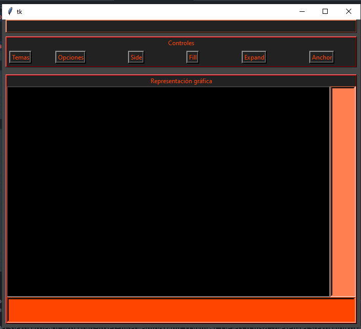

## ***Paso 6: Botones de secciones de representación - estructura6.py***

Dentro de las secciones de representación gráfica, ubicamos tres botones, uno dentro de cada sección, y crearemos un diccionario que contenga como clave el texto de cada botón, y una variable de instancia asociada a cada uno como valor.

``estructura6.py``

```python
from tkinter import *


class MiApp:
    def __init__(self, parent=None, **configs):

        # ##################################################################
        # Ventana principal
        # ##################################################################
        self.my_parent = parent
        self.my_parent.geometry("700x600")

        # ##################################################################
        # Agrego contenedor
        # ##################################################################
        self.contenedor = Frame(self.my_parent, bg="#444")
        self.contenedor.pack(expand=YES, fill=BOTH)
        # ##################################################################
        # Agrego Secciones Principales
        # ##################################################################
        #####  CERRAR #####
        self.seccion_cerrar = Frame(
            self.contenedor, bg="#FF7F50", height=22, borderwidth=2, relief=RAISED
        )
        self.seccion_cerrar.pack(side=TOP, expand=NO, fill=X, padx=7)
        self.cerrar = Frame(self.seccion_cerrar, bg="#222", height=22)
        self.cerrar.pack(side=TOP, expand=NO, fill=X)

        #####  SECCIÓN CONTROLES #####
        self.seccion_controles = Frame(
            self.contenedor, bg="red", borderwidth=2, relief=RAISED
        )
        self.seccion_controles.pack(side=TOP, expand=NO, fill=BOTH, padx=7, pady=7)
        titulo_controles = "Controles"
        Label(
            self.seccion_controles,
            text=titulo_controles,
            bg="#222",
            fg="OrangeRed",
            justify=LEFT,
        ).pack(side=TOP, expand=NO, fill=X, anchor=W)
        self.controles = Frame(self.seccion_controles, bg="#222")
        self.controles.pack(side=TOP, expand=NO, fill=X)

        #####  SECCIÓN REPRESENTACIÓN #####
        self.seccion_representacion = Frame(
            self.contenedor, bg="red", borderwidth=2, relief=RAISED
        )
        self.seccion_representacion.pack(
            side=BOTTOM, expand=YES, fill=BOTH, padx=7, pady=7
        )
        titulo_grafico = "Representación gráfica"
        Label(
            self.seccion_representacion,
            text=titulo_grafico,
            bg="#222",
            fg="OrangeRed",
            justify=LEFT,
        ).pack(side=TOP, expand=NO, fill=X, anchor=W)
        self.representacion = Frame(self.seccion_representacion, bg="OrangeRed")
        self.representacion.pack(side=TOP, expand=YES, fill=BOTH)
        # ##################################################################
        # Controles
        # ##################################################################
        self.temas_opciones = Frame(self.controles, borderwidth=5, bg="#222")
        self.nombres_opciones = Frame(self.controles, borderwidth=5, bg="#222")
        self.side_contenedor = Frame(self.controles, borderwidth=5, bg="#222")
        self.fill_contenedor = Frame(self.controles, borderwidth=5, bg="#222")
        self.expand_contenedor = Frame(self.controles, borderwidth=5, bg="#222")
        self.anchor_contenedor = Frame(self.controles, borderwidth=5, bg="#222")

        self.temas_opciones.pack(side=LEFT, expand=NO, fill=Y, anchor=N)
        self.nombres_opciones.pack(side=LEFT, expand=YES, fill=Y, anchor=N)
        self.side_contenedor.pack(side=LEFT, expand=YES, anchor=N)
        self.fill_contenedor.pack(side=LEFT, expand=YES, anchor=N)
        self.expand_contenedor.pack(side=LEFT, expand=YES, anchor=N)
        self.anchor_contenedor.pack(side=LEFT, expand=YES, anchor=N)

        Label(
            self.temas_opciones,
            borderwidth=4,
            relief=RAISED,
            text="Temas",
            bg="#222",
            fg="OrangeRed",
        ).pack(fill=X)
        Label(
            self.nombres_opciones,
            borderwidth=4,
            relief=RAISED,
            text="Opciones",
            bg="#222",
            fg="OrangeRed",
        ).pack(fill=X)
        Label(
            self.side_contenedor,
            borderwidth=4,
            relief=RAISED,
            text="Side",
            bg="#222",
            fg="OrangeRed",
        ).pack(fill=X)
        Label(
            self.fill_contenedor,
            borderwidth=4,
            relief=RAISED,
            text="Fill",
            bg="#222",
            fg="OrangeRed",
        ).pack(fill=X)
        Label(
            self.expand_contenedor,
            borderwidth=4,
            relief=RAISED,
            text="Expand",
            bg="#222",
            fg="OrangeRed",
        ).pack(fill=X)
        Label(
            self.anchor_contenedor,
            borderwidth=4,
            relief=RAISED,
            text="Anchor",
            bg="#222",
            fg="OrangeRed",
        ).pack(fill=X)

        # ##################################################################
        # Representación
        # ##################################################################
        self.representacion_superior = Frame(self.representacion, bg="red")
        self.representacion_superior.pack(side=TOP, expand=YES, fill=BOTH)

        self.deslizador_central = Frame(
            self.representacion_superior,
            background="black",
            borderwidth=4,
            relief=SUNKEN,
            width=250,
        )
        self.deslizador_central.pack(side=LEFT, expand=YES, fill=BOTH)

        self.deslizador_vertical = Frame(
            self.representacion_superior,
            background="#FF7F50",
            borderwidth=4,
            relief=SUNKEN,
            width=50,
        )
        self.deslizador_vertical.pack(side=RIGHT, expand=NO, fill=Y)

        self.deslizador_horizontal = Frame(
            self.representacion, borderwidth=4, relief=SUNKEN, height=50, bg="OrangeRed"
        )
        self.deslizador_horizontal.pack(side=TOP, fill=X)
        # ##################################################################
        # Texto de botones parte gráfica
        # ##################################################################

        self.botonVyH = Button(self.deslizador_central, text="VyH")
        self.botonVyH.pack()
        self.botonV = Button(self.deslizador_vertical, text="V")
        self.botonV.pack()
        self.botonH = Button(self.deslizador_horizontal, text="H")
        self.botonH.pack()
        self.elegir_nombre_botones = {
            "VyH": self.botonVyH,
            "V": self.botonV,
            "H": self.botonH,
        }


if __name__ == "__main__":
    root = Tk()
    MiApp(root)
    root.mainloop()
```

La representacion gráfica nos queda:

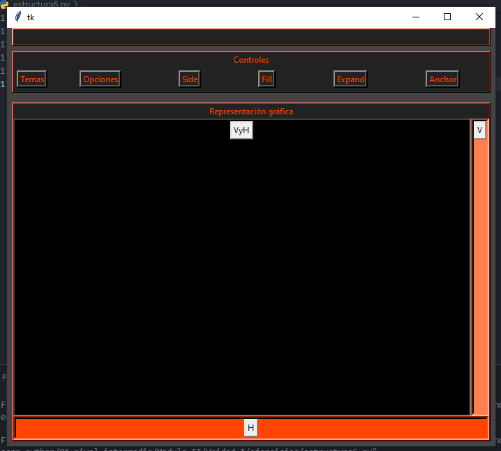0

## ***Paso 7: Nombres en controles - estructura7.py***

Este paso no incluye representación gráfica, ya que lo único que haremos aquí es incluir una lista de opciones por cada grupo opciones que vamos a incluir en pantalla.

``estructura7.py``

```python
from tkinter import *


class MiApp:
    def __init__(self, parent=None, **configs):

        # ##################################################################
        # Ventana principal
        # ##################################################################
        self.my_parent = parent
        self.my_parent.geometry("700x600")

        # ##################################################################
        # Agrego contenedor
        # ##################################################################
        self.contenedor = Frame(self.my_parent, bg="#444")
        self.contenedor.pack(expand=YES, fill=BOTH)
        # ##################################################################
        # Agrego Secciones Principales
        # ##################################################################
        #####  CERRAR #####
        self.seccion_cerrar = Frame(
            self.contenedor, bg="#FF7F50", height=22, borderwidth=2, relief=RAISED
        )
        self.seccion_cerrar.pack(side=TOP, expand=NO, fill=X, padx=7)
        self.cerrar = Frame(self.seccion_cerrar, bg="#222", height=22)
        self.cerrar.pack(side=TOP, expand=NO, fill=X)

        #####  SECCIÓN CONTROLES #####
        self.seccion_controles = Frame(
            self.contenedor, bg="red", borderwidth=2, relief=RAISED
        )
        self.seccion_controles.pack(side=TOP, expand=NO, fill=BOTH, padx=7, pady=7)
        titulo_controles = "Controles"
        Label(
            self.seccion_controles,
            text=titulo_controles,
            bg="#222",
            fg="OrangeRed",
            justify=LEFT,
        ).pack(side=TOP, expand=NO, fill=X, anchor=W)
        self.controles = Frame(self.seccion_controles, bg="#222")
        self.controles.pack(side=TOP, expand=NO, fill=X)

        #####  SECCIÓN REPRESENTACIÓN #####
        self.seccion_representacion = Frame(
            self.contenedor, bg="red", borderwidth=2, relief=RAISED
        )
        self.seccion_representacion.pack(
            side=BOTTOM, expand=YES, fill=BOTH, padx=7, pady=7
        )
        titulo_grafico = "Representación gráfica"
        Label(
            self.seccion_representacion,
            text=titulo_grafico,
            bg="#222",
            fg="OrangeRed",
            justify=LEFT,
        ).pack(side=TOP, expand=NO, fill=X, anchor=W)
        self.representacion = Frame(self.seccion_representacion, bg="OrangeRed")
        self.representacion.pack(side=TOP, expand=YES, fill=BOTH)
        # ##################################################################
        # Controles
        # ##################################################################
        self.temas_opciones = Frame(self.controles, borderwidth=5, bg="#222")
        self.nombres_opciones = Frame(self.controles, borderwidth=5, bg="#222")
        self.side_contenedor = Frame(self.controles, borderwidth=5, bg="#222")
        self.fill_contenedor = Frame(self.controles, borderwidth=5, bg="#222")
        self.expand_contenedor = Frame(self.controles, borderwidth=5, bg="#222")
        self.anchor_contenedor = Frame(self.controles, borderwidth=5, bg="#222")

        self.temas_opciones.pack(side=LEFT, expand=NO, fill=Y, anchor=N)
        self.nombres_opciones.pack(side=LEFT, expand=YES, fill=Y, anchor=N)
        self.side_contenedor.pack(side=LEFT, expand=YES, anchor=N)
        self.fill_contenedor.pack(side=LEFT, expand=YES, anchor=N)
        self.expand_contenedor.pack(side=LEFT, expand=YES, anchor=N)
        self.anchor_contenedor.pack(side=LEFT, expand=YES, anchor=N)

        Label(
            self.temas_opciones,
            borderwidth=4,
            relief=RAISED,
            text="Temas",
            bg="#222",
            fg="OrangeRed",
        ).pack(fill=X)
        Label(
            self.nombres_opciones,
            borderwidth=4,
            relief=RAISED,
            text="Opciones",
            bg="#222",
            fg="OrangeRed",
        ).pack(fill=X)
        Label(
            self.side_contenedor,
            borderwidth=4,
            relief=RAISED,
            text="Side",
            bg="#222",
            fg="OrangeRed",
        ).pack(fill=X)
        Label(
            self.fill_contenedor,
            borderwidth=4,
            relief=RAISED,
            text="Fill",
            bg="#222",
            fg="OrangeRed",
        ).pack(fill=X)
        Label(
            self.expand_contenedor,
            borderwidth=4,
            relief=RAISED,
            text="Expand",
            bg="#222",
            fg="OrangeRed",
        ).pack(fill=X)
        Label(
            self.anchor_contenedor,
            borderwidth=4,
            relief=RAISED,
            text="Anchor",
            bg="#222",
            fg="OrangeRed",
        ).pack(fill=X)

        # ##################################################################
        # Representación
        # ##################################################################
        self.representacion_superior = Frame(self.representacion, bg="red")
        self.representacion_superior.pack(side=TOP, expand=YES, fill=BOTH)

        self.deslizador_central = Frame(
            self.representacion_superior,
            background="black",
            borderwidth=4,
            relief=SUNKEN,
            width=250,
        )
        self.deslizador_central.pack(side=LEFT, expand=YES, fill=BOTH)

        self.deslizador_vertical = Frame(
            self.representacion_superior,
            background="#FF7F50",
            borderwidth=4,
            relief=SUNKEN,
            width=50,
        )
        self.deslizador_vertical.pack(side=RIGHT, expand=NO, fill=Y)

        self.deslizador_horizontal = Frame(
            self.representacion, borderwidth=4, relief=SUNKEN, height=50, bg="OrangeRed"
        )
        self.deslizador_horizontal.pack(side=TOP, fill=X)
        # ##################################################################
        # Texto de botones parte gráfica
        # ##################################################################

        self.botonVyH = Button(self.deslizador_central, text="VyH")
        self.botonVyH.pack()
        self.botonV = Button(self.deslizador_vertical, text="V")
        self.botonV.pack()
        self.botonH = Button(self.deslizador_horizontal, text="H")
        self.botonH.pack()
        self.elegir_nombre_botones = {
            "VyH": self.botonVyH,
            "V": self.botonV,
            "H": self.botonH,
        }

        # ##################################################################
        # Nombres en controles
        # ##################################################################
        temas = ["tema1", "tema2", "tema3"]
        nombres = ["VyH", "V", "H"]
        side_options = [LEFT, TOP, RIGHT, BOTTOM]
        fill_options = [X, Y, BOTH, NONE]
        expand_options = [YES, NO]
        anchor_options = [NW, N, NE, E, SE, S, SW, W, CENTER]


if __name__ == "__main__":
    root = Tk()
    MiApp(root)
    root.mainloop()
```

## ***Paso 8: Agregar controles - estructura8.py*** 

Para agregar las opciones de cada grupo de botones, utilizamos la estructura for para recorrer las listas de nombres creadas en el paso anterior, y realizar la asignación. Notar que al setear el atributo "indicatorio" del botón, a "1" este representa lo que en html sería un tipo de selector de formulario "radio".

``estructura8.py``

```python
from tkinter import *


class MiApp:
    def __init__(self, parent=None, **configs):

        # ##################################################################
        # Ventana principal
        # ##################################################################
        self.my_parent = parent
        self.my_parent.geometry("700x600")

        # ##################################################################
        # Agrego contenedor
        # ##################################################################
        self.contenedor = Frame(self.my_parent, bg="#444")
        self.contenedor.pack(expand=YES, fill=BOTH)
        # ##################################################################
        # Agrego Secciones Principales
        # ##################################################################
        #####  CERRAR #####
        self.seccion_cerrar = Frame(
            self.contenedor, bg="#FF7F50", height=22, borderwidth=2, relief=RAISED
        )
        self.seccion_cerrar.pack(side=TOP, expand=NO, fill=X, padx=7)
        self.cerrar = Frame(self.seccion_cerrar, bg="#222", height=22)
        self.cerrar.pack(side=TOP, expand=NO, fill=X)

        #####  SECCIÓN CONTROLES #####
        self.seccion_controles = Frame(
            self.contenedor, bg="red", borderwidth=2, relief=RAISED
        )
        self.seccion_controles.pack(side=TOP, expand=NO, fill=BOTH, padx=7, pady=7)
        titulo_controles = "Controles"
        Label(
            self.seccion_controles,
            text=titulo_controles,
            bg="#222",
            fg="OrangeRed",
            justify=LEFT,
        ).pack(side=TOP, expand=NO, fill=X, anchor=W)
        self.controles = Frame(self.seccion_controles, bg="#222")
        self.controles.pack(side=TOP, expand=NO, fill=X)

        #####  SECCIÓN REPRESENTACIÓN #####
        self.seccion_representacion = Frame(
            self.contenedor, bg="red", borderwidth=2, relief=RAISED
        )
        self.seccion_representacion.pack(
            side=BOTTOM, expand=YES, fill=BOTH, padx=7, pady=7
        )
        titulo_grafico = "Representación gráfica"
        Label(
            self.seccion_representacion,
            text=titulo_grafico,
            bg="#222",
            fg="OrangeRed",
            justify=LEFT,
        ).pack(side=TOP, expand=NO, fill=X, anchor=W)
        self.representacion = Frame(self.seccion_representacion, bg="OrangeRed")
        self.representacion.pack(side=TOP, expand=YES, fill=BOTH)
        # ##################################################################
        # Controles
        # ##################################################################
        self.temas_opciones = Frame(self.controles, borderwidth=5, bg="#222")
        self.nombres_opciones = Frame(self.controles, borderwidth=5, bg="#222")
        self.side_contenedor = Frame(self.controles, borderwidth=5, bg="#222")
        self.fill_contenedor = Frame(self.controles, borderwidth=5, bg="#222")
        self.expand_contenedor = Frame(self.controles, borderwidth=5, bg="#222")
        self.anchor_contenedor = Frame(self.controles, borderwidth=5, bg="#222")

        self.temas_opciones.pack(side=LEFT, expand=NO, fill=Y, anchor=N)
        self.nombres_opciones.pack(side=LEFT, expand=YES, fill=Y, anchor=N)
        self.side_contenedor.pack(side=LEFT, expand=YES, anchor=N)
        self.fill_contenedor.pack(side=LEFT, expand=YES, anchor=N)
        self.expand_contenedor.pack(side=LEFT, expand=YES, anchor=N)
        self.anchor_contenedor.pack(side=LEFT, expand=YES, anchor=N)

        Label(
            self.temas_opciones,
            borderwidth=4,
            relief=RAISED,
            text="Temas",
            bg="#222",
            fg="OrangeRed",
        ).pack(fill=X)
        Label(
            self.nombres_opciones,
            borderwidth=4,
            relief=RAISED,
            text="Opciones",
            bg="#222",
            fg="OrangeRed",
        ).pack(fill=X)
        Label(
            self.side_contenedor,
            borderwidth=4,
            relief=RAISED,
            text="Side",
            bg="#222",
            fg="OrangeRed",
        ).pack(fill=X)
        Label(
            self.fill_contenedor,
            borderwidth=4,
            relief=RAISED,
            text="Fill",
            bg="#222",
            fg="OrangeRed",
        ).pack(fill=X)
        Label(
            self.expand_contenedor,
            borderwidth=4,
            relief=RAISED,
            text="Expand",
            bg="#222",
            fg="OrangeRed",
        ).pack(fill=X)
        Label(
            self.anchor_contenedor,
            borderwidth=4,
            relief=RAISED,
            text="Anchor",
            bg="#222",
            fg="OrangeRed",
        ).pack(fill=X)

        # ##################################################################
        # Representación
        # ##################################################################
        self.representacion_superior = Frame(self.representacion, bg="red")
        self.representacion_superior.pack(side=TOP, expand=YES, fill=BOTH)

        self.deslizador_central = Frame(
            self.representacion_superior,
            background="black",
            borderwidth=4,
            relief=SUNKEN,
            width=250,
        )
        self.deslizador_central.pack(side=LEFT, expand=YES, fill=BOTH)

        self.deslizador_vertical = Frame(
            self.representacion_superior,
            background="#FF7F50",
            borderwidth=4,
            relief=SUNKEN,
            width=50,
        )
        self.deslizador_vertical.pack(side=RIGHT, expand=NO, fill=Y)

        self.deslizador_horizontal = Frame(
            self.representacion, borderwidth=4, relief=SUNKEN, height=50, bg="OrangeRed"
        )
        self.deslizador_horizontal.pack(side=TOP, fill=X)
        # ##################################################################
        # Texto de botones parte gráfica
        # ##################################################################

        self.botonVyH = Button(self.deslizador_central, text="VyH")
        self.botonVyH.pack()
        self.botonV = Button(self.deslizador_vertical, text="V")
        self.botonV.pack()
        self.botonH = Button(self.deslizador_horizontal, text="H")
        self.botonH.pack()
        self.elegir_nombre_botones = {
            "VyH": self.botonVyH,
            "V": self.botonV,
            "H": self.botonH,
        }

        # ##################################################################
        # Nombres en controles
        # ##################################################################
        temas = ["tema1", "tema2", "tema3"]
        nombres = ["VyH", "V", "H"]
        side_options = [LEFT, TOP, RIGHT, BOTTOM]
        fill_options = [X, Y, BOTH, NONE]
        expand_options = [YES, NO]
        anchor_options = [NW, N, NE, E, SE, S, SW, W, CENTER]

        # Agrego opciones de colores para bg y fg
        self.bg_colors = ["#222", "blue", "OrangeRed"]

        # ##################################################################
        # Opciones de controles
        # ##################################################################

        for opcion in temas:
            boton = Radiobutton(
                self.temas_opciones,
                text=str(opcion),
                indicatoron=1,
                value=opcion,
                bg="#222",
                fg="OrangeRed",
            )
            boton.pack(side=TOP)

        for opcion in nombres:
            boton = Radiobutton(self.side_contenedor, text=str(opcion), indicatoron=0)
            boton.pack(side=TOP)

        for opcion in side_options:
            boton = Radiobutton(self.side_contenedor, text=str(opcion), indicatoron=0)
            boton.pack(side=TOP)

        for opcion in fill_options:
            boton = Radiobutton(self.fill_contenedor, text=str(opcion), indicatoron=0)
            boton.pack(side=TOP)

        for opcion in expand_options:
            boton = Radiobutton(self.expand_contenedor, text=str(opcion), indicatoron=0)
            boton.pack(side=TOP)

        for opcion in anchor_options:
            boton = Radiobutton(self.anchor_contenedor, text=str(opcion), indicatoron=0)
            boton.pack(side=TOP)


if __name__ == "__main__":
    root = Tk()
    MiApp(root)
    root.mainloop()
```

La representación gráfica nos queda:

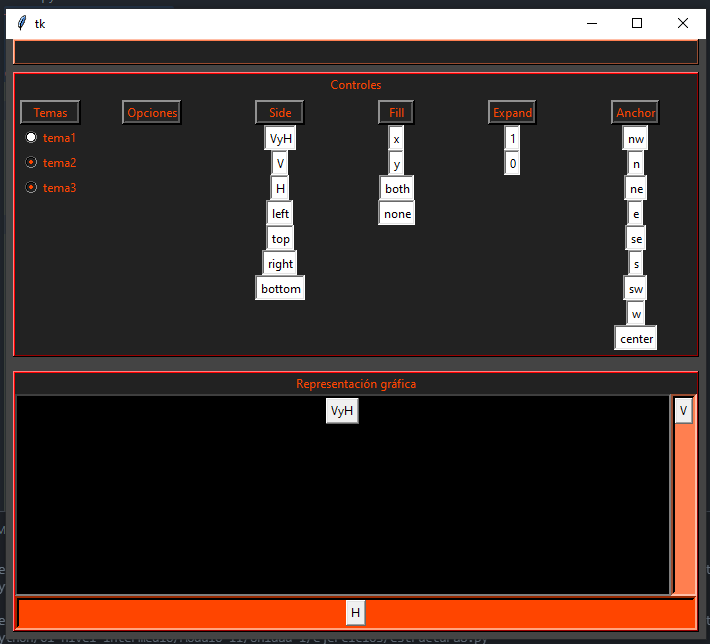

## ***Paso 9: Defino variables por defecto - estructura9.py***

Este paso no posee representación gráfica, ya que lo que estamos agregando es un grupo de opciones de valores por defecto, que utilizaremos para que cuando en las opciones de pantalla cambiemos el botón sobre el que queremos trabajar, los valores se reseteen a este estado de condiciones.

Al utilizar StringVar() estamos utilizando una clase de variable de tkinter, que nos permite realizar un seguimiento del valor que las variables van tomando.

``estructura9.py``

```python
from tkinter import *


class MiApp:
    def __init__(self, parent=None, **configs):

        # ##################################################################
        # Defino variables por defecto
        # ##################################################################
        self.temas = StringVar()
        self.temas.set("tema1")

        self.nombres = StringVar()
        self.nombres.set("VyH")

        self.side_option = StringVar()
        self.side_option.set(LEFT)

        self.fill_option = StringVar()
        self.fill_option.set(NONE)

        self.expand_option = StringVar()
        self.expand_option.set(YES)

        self.anchor_option = StringVar()
        self.anchor_option.set(N)

        # Agrego variables de contorl para eleccion de tema
        self.tema_option = IntVar(value=0)

        # ##################################################################
        # Ventana principal
        # ##################################################################
        self.my_parent = parent
        self.my_parent.geometry("700x600")

        # ##################################################################
        # Agrego contenedor
        # ##################################################################
        self.contenedor = Frame(self.my_parent, bg="#444")
        self.contenedor.pack(expand=YES, fill=BOTH)
        # ##################################################################
        # Agrego Secciones Principales
        # ##################################################################
        #####  CERRAR #####
        self.seccion_cerrar = Frame(
            self.contenedor, bg="#FF7F50", height=22, borderwidth=2, relief=RAISED
        )
        self.seccion_cerrar.pack(side=TOP, expand=NO, fill=X, padx=7)
        self.cerrar = Frame(self.seccion_cerrar, bg="#222", height=22)
        self.cerrar.pack(side=TOP, expand=NO, fill=X)

        #####  SECCIÓN CONTROLES #####
        self.seccion_controles = Frame(
            self.contenedor, bg="red", borderwidth=2, relief=RAISED
        )
        self.seccion_controles.pack(side=TOP, expand=NO, fill=BOTH, padx=7, pady=7)
        titulo_controles = "Controles"
        Label(
            self.seccion_controles,
            text=titulo_controles,
            bg="#222",
            fg="OrangeRed",
            justify=LEFT,
        ).pack(side=TOP, expand=NO, fill=X, anchor=W)
        self.controles = Frame(self.seccion_controles, bg="#222")
        self.controles.pack(side=TOP, expand=NO, fill=X)

        #####  SECCIÓN REPRESENTACIÓN #####
        self.seccion_representacion = Frame(
            self.contenedor, bg="red", borderwidth=2, relief=RAISED
        )
        self.seccion_representacion.pack(
            side=BOTTOM, expand=YES, fill=BOTH, padx=7, pady=7
        )
        titulo_grafico = "Representación gráfica"
        Label(
            self.seccion_representacion,
            text=titulo_grafico,
            bg="#222",
            fg="OrangeRed",
            justify=LEFT,
        ).pack(side=TOP, expand=NO, fill=X, anchor=W)
        self.representacion = Frame(self.seccion_representacion, bg="OrangeRed")
        self.representacion.pack(side=TOP, expand=YES, fill=BOTH)
        # ##################################################################
        # Controles
        # ##################################################################
        self.temas_opciones = Frame(self.controles, borderwidth=5, bg="#222")
        self.nombres_opciones = Frame(self.controles, borderwidth=5, bg="#222")
        self.side_contenedor = Frame(self.controles, borderwidth=5, bg="#222")
        self.fill_contenedor = Frame(self.controles, borderwidth=5, bg="#222")
        self.expand_contenedor = Frame(self.controles, borderwidth=5, bg="#222")
        self.anchor_contenedor = Frame(self.controles, borderwidth=5, bg="#222")

        self.temas_opciones.pack(side=LEFT, expand=NO, fill=Y, anchor=N)
        self.nombres_opciones.pack(side=LEFT, expand=YES, fill=Y, anchor=N)
        self.side_contenedor.pack(side=LEFT, expand=YES, anchor=N)
        self.fill_contenedor.pack(side=LEFT, expand=YES, anchor=N)
        self.expand_contenedor.pack(side=LEFT, expand=YES, anchor=N)
        self.anchor_contenedor.pack(side=LEFT, expand=YES, anchor=N)

        Label(
            self.temas_opciones,
            borderwidth=4,
            relief=RAISED,
            text="Temas",
            bg="#222",
            fg="OrangeRed",
        ).pack(fill=X)
        Label(
            self.nombres_opciones,
            borderwidth=4,
            relief=RAISED,
            text="Opciones",
            bg="#222",
            fg="OrangeRed",
        ).pack(fill=X)
        Label(
            self.side_contenedor,
            borderwidth=4,
            relief=RAISED,
            text="Side",
            bg="#222",
            fg="OrangeRed",
        ).pack(fill=X)
        Label(
            self.fill_contenedor,
            borderwidth=4,
            relief=RAISED,
            text="Fill",
            bg="#222",
            fg="OrangeRed",
        ).pack(fill=X)
        Label(
            self.expand_contenedor,
            borderwidth=4,
            relief=RAISED,
            text="Expand",
            bg="#222",
            fg="OrangeRed",
        ).pack(fill=X)
        Label(
            self.anchor_contenedor,
            borderwidth=4,
            relief=RAISED,
            text="Anchor",
            bg="#222",
            fg="OrangeRed",
        ).pack(fill=X)

        # ##################################################################
        # Representación
        # ##################################################################
        self.representacion_superior = Frame(self.representacion, bg="red")
        self.representacion_superior.pack(side=TOP, expand=YES, fill=BOTH)

        self.deslizador_central = Frame(
            self.representacion_superior,
            background="black",
            borderwidth=4,
            relief=SUNKEN,
            width=250,
        )
        self.deslizador_central.pack(side=LEFT, expand=YES, fill=BOTH)

        self.deslizador_vertical = Frame(
            self.representacion_superior,
            background="#FF7F50",
            borderwidth=4,
            relief=SUNKEN,
            width=50,
        )
        self.deslizador_vertical.pack(side=RIGHT, expand=NO, fill=Y)

        self.deslizador_horizontal = Frame(
            self.representacion, borderwidth=4, relief=SUNKEN, height=50, bg="OrangeRed"
        )
        self.deslizador_horizontal.pack(side=TOP, fill=X)
        # ##################################################################
        # Texto de botones parte gráfica
        # ##################################################################

        self.botonVyH = Button(self.deslizador_central, text="VyH")
        self.botonVyH.pack()
        self.botonV = Button(self.deslizador_vertical, text="V")
        self.botonV.pack()
        self.botonH = Button(self.deslizador_horizontal, text="H")
        self.botonH.pack()
        self.elegir_nombre_botones = {
            "VyH": self.botonVyH,
            "V": self.botonV,
            "H": self.botonH,
        }

        # ##################################################################
        # Nombres en controles
        # ##################################################################
        temas = ["tema1", "tema2", "tema3"]
        nombres = ["VyH", "V", "H"]
        side_options = [LEFT, TOP, RIGHT, BOTTOM]
        fill_options = [X, Y, BOTH, NONE]
        expand_options = [YES, NO]
        anchor_options = [NW, N, NE, E, SE, S, SW, W, CENTER]

        # ##################################################################
        # Opciones de controles
        # ##################################################################

        for opcion in temas:
            boton = Radiobutton(
                self.temas_opciones,
                text=str(opcion),
                indicatoron=1,
                value=opcion,
                bg="#222",
                fg="OrangeRed",
            )
            boton.pack(side=TOP)

        for opcion in nombres:
            boton = Radiobutton(self.nombres_opciones, text=str(opcion), indicatoron=1)
            boton.pack(side=TOP)

        for opcion in side_options:
            boton = Radiobutton(self.side_contenedor, text=str(opcion), indicatoron=0)
            boton.pack(side=TOP)

        for opcion in fill_options:
            boton = Radiobutton(self.fill_contenedor, text=str(opcion), indicatoron=0)
            boton.pack(side=TOP)

        for opcion in expand_options:
            boton = Radiobutton(self.expand_contenedor, text=str(opcion), indicatoron=0)
            boton.pack(side=TOP)

        for opcion in anchor_options:
            boton = Radiobutton(self.anchor_contenedor, text=str(opcion), indicatoron=0)
            boton.pack(side=TOP)


if __name__ == "__main__":
    root = Tk()
    MiApp(root)
    root.mainloop()
```

## Paso 10: Defino parámetros por defecto - estructura10.py

Puedo definir un grupo de parámetros por defecto (en este caso solo el ancho ) y asignarlo luego a un elemento. Para realizar esto trabajamos con el elemento como si fuera una lista, por ejemplo en el script le hemos asociado un ancho a los botones de los controles de la siguiente forma:

```python
boton["width"] = ancho_boton
```

``estructura10.py``

```python
from tkinter import *


class MiApp:
    def __init__(self, parent=None, **configs):

        # ##################################################################
        # Defino parámetros
        # ##################################################################
        ancho_boton = 10

        # ##################################################################
        # Defino variables por defecto
        # ##################################################################
        self.temas = StringVar()
        self.temas.set("tema1")

        self.nombres = StringVar()
        self.nombres.set("VyH")

        self.side_option = StringVar()
        self.side_option.set(LEFT)

        self.fill_option = StringVar()
        self.fill_option.set(NONE)

        self.expand_option = StringVar()
        self.expand_option.set(YES)

        self.anchor_option = StringVar()
        self.anchor_option.set(N)

        # Agrego variables de contorl para eleccion de tema
        self.tema_option = IntVar(value=0)

        # ##################################################################
        # Ventana principal
        # ##################################################################
        self.my_parent = parent
        self.my_parent.geometry("700x600")

        # ##################################################################
        # Agrego contenedor
        # ##################################################################
        self.contenedor = Frame(self.my_parent, bg="#444")
        self.contenedor.pack(expand=YES, fill=BOTH)
        # ##################################################################
        # Agrego Secciones Principales
        # ##################################################################
        #####  CERRAR #####
        self.seccion_cerrar = Frame(
            self.contenedor, bg="#FF7F50", height=22, borderwidth=2, relief=RAISED
        )
        self.seccion_cerrar.pack(side=TOP, expand=NO, fill=X, padx=7)
        self.cerrar = Frame(self.seccion_cerrar, bg="#222", height=22)
        self.cerrar.pack(side=TOP, expand=NO, fill=X)

        #####  SECCIÓN CONTROLES #####
        self.seccion_controles = Frame(
            self.contenedor, bg="red", borderwidth=2, relief=RAISED
        )
        self.seccion_controles.pack(side=TOP, expand=NO, fill=BOTH, padx=7, pady=7)
        titulo_controles = "Controles"
        Label(
            self.seccion_controles,
            text=titulo_controles,
            bg="#222",
            fg="OrangeRed",
            justify=LEFT,
        ).pack(side=TOP, expand=NO, fill=X, anchor=W)
        self.controles = Frame(self.seccion_controles, bg="#222")
        self.controles.pack(side=TOP, expand=NO, fill=X)

        #####  SECCIÓN REPRESENTACIÓN #####
        self.seccion_representacion = Frame(
            self.contenedor, bg="red", borderwidth=2, relief=RAISED
        )
        self.seccion_representacion.pack(
            side=BOTTOM, expand=YES, fill=BOTH, padx=7, pady=7
        )
        titulo_grafico = "Representación gráfica"
        Label(
            self.seccion_representacion,
            text=titulo_grafico,
            bg="#222",
            fg="OrangeRed",
            justify=LEFT,
        ).pack(side=TOP, expand=NO, fill=X, anchor=W)
        self.representacion = Frame(self.seccion_representacion, bg="OrangeRed")
        self.representacion.pack(side=TOP, expand=YES, fill=BOTH)
        # ##################################################################
        # Controles
        # ##################################################################
        self.temas_opciones = Frame(self.controles, borderwidth=5, bg="#222")
        self.nombres_opciones = Frame(self.controles, borderwidth=5, bg="#222")
        self.side_contenedor = Frame(self.controles, borderwidth=5, bg="#222")
        self.fill_contenedor = Frame(self.controles, borderwidth=5, bg="#222")
        self.expand_contenedor = Frame(self.controles, borderwidth=5, bg="#222")
        self.anchor_contenedor = Frame(self.controles, borderwidth=5, bg="#222")

        self.temas_opciones.pack(side=LEFT, expand=NO, fill=Y, anchor=N)
        self.nombres_opciones.pack(side=LEFT, expand=YES, fill=Y, anchor=N)
        self.side_contenedor.pack(side=LEFT, expand=YES, anchor=N)
        self.fill_contenedor.pack(side=LEFT, expand=YES, anchor=N)
        self.expand_contenedor.pack(side=LEFT, expand=YES, anchor=N)
        self.anchor_contenedor.pack(side=LEFT, expand=YES, anchor=N)

        Label(
            self.temas_opciones,
            borderwidth=4,
            relief=RAISED,
            text="Temas",
            bg="#222",
            fg="OrangeRed",
        ).pack(fill=X)
        Label(
            self.nombres_opciones,
            borderwidth=4,
            relief=RAISED,
            text="Opciones",
            bg="#222",
            fg="OrangeRed",
        ).pack(fill=X)
        Label(
            self.side_contenedor,
            borderwidth=4,
            relief=RAISED,
            text="Side",
            bg="#222",
            fg="OrangeRed",
        ).pack(fill=X)
        Label(
            self.fill_contenedor,
            borderwidth=4,
            relief=RAISED,
            text="Fill",
            bg="#222",
            fg="OrangeRed",
        ).pack(fill=X)
        Label(
            self.expand_contenedor,
            borderwidth=4,
            relief=RAISED,
            text="Expand",
            bg="#222",
            fg="OrangeRed",
        ).pack(fill=X)
        Label(
            self.anchor_contenedor,
            borderwidth=4,
            relief=RAISED,
            text="Anchor",
            bg="#222",
            fg="OrangeRed",
        ).pack(fill=X)

        # ##################################################################
        # Representación
        # ##################################################################
        self.representacion_superior = Frame(self.representacion, bg="red")
        self.representacion_superior.pack(side=TOP, expand=YES, fill=BOTH)

        self.deslizador_central = Frame(
            self.representacion_superior,
            background="black",
            borderwidth=4,
            relief=SUNKEN,
            width=250,
        )
        self.deslizador_central.pack(side=LEFT, expand=YES, fill=BOTH)

        self.deslizador_vertical = Frame(
            self.representacion_superior,
            background="#FF7F50",
            borderwidth=4,
            relief=SUNKEN,
            width=50,
        )
        self.deslizador_vertical.pack(side=RIGHT, expand=NO, fill=Y)

        self.deslizador_horizontal = Frame(
            self.representacion, borderwidth=4, relief=SUNKEN, height=50, bg="OrangeRed"
        )
        self.deslizador_horizontal.pack(side=TOP, fill=X)
        # ##################################################################
        # Texto de botones parte gráfica
        # ##################################################################

        self.botonVyH = Button(self.deslizador_central, text="VyH")
        self.botonVyH.pack()
        self.botonV = Button(self.deslizador_vertical, text="V")
        self.botonV.pack()
        self.botonH = Button(self.deslizador_horizontal, text="H")
        self.botonH.pack()
        self.elegir_nombre_botones = {
            "VyH": self.botonVyH,
            "V": self.botonV,
            "H": self.botonH,
        }

        # ##################################################################
        # Nombres en controles
        # ##################################################################
        temas = ["tema1", "tema2", "tema3"]
        nombres = ["VyH", "V", "H"]
        side_options = [LEFT, TOP, RIGHT, BOTTOM]
        fill_options = [X, Y, BOTH, NONE]
        expand_options = [YES, NO]
        anchor_options = [NW, N, NE, E, SE, S, SW, W, CENTER]

        # Agrego opciones de colores para bg y fg
        self.bg_colors = ["#222", "blue", "OrangeRed"]

        # ##################################################################
        # Opciones de controles
        # ##################################################################

        for opcion in temas:
            boton = Radiobutton(
                self.temas_opciones,
                text=str(opcion),
                indicatoron=1,
                value=opcion,
                bg="#222",
                fg="OrangeRed",
            )
            boton["width"] = ancho_boton
            boton.pack(side=TOP)

        for opcion in nombres:
            boton = Radiobutton(self.nombres_opciones, text=str(opcion), indicatoron=1)
            boton["width"] = ancho_boton
            boton.pack(side=TOP)

        for opcion in side_options:
            boton = Radiobutton(self.side_contenedor, text=str(opcion), indicatoron=0)
            boton["width"] = ancho_boton
            boton.pack(side=TOP)

        for opcion in fill_options:
            boton = Radiobutton(self.fill_contenedor, text=str(opcion), indicatoron=0)
            boton["width"] = ancho_boton
            boton.pack(side=TOP)

        for opcion in expand_options:
            boton = Radiobutton(self.expand_contenedor, text=str(opcion), indicatoron=0)
            boton["width"] = ancho_boton
            boton.pack(side=TOP)

        for opcion in anchor_options:
            boton = Radiobutton(self.anchor_contenedor, text=str(opcion), indicatoron=0)
            boton["width"] = ancho_boton
            boton.pack(side=TOP)


if __name__ == "__main__":
    root = Tk()
    MiApp(root)
    root.mainloop()
```

La representación nos queda:

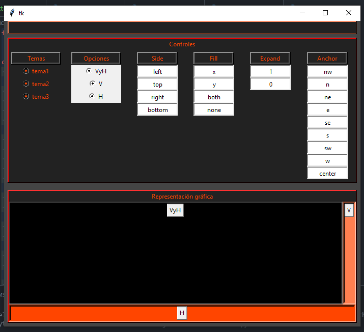

## ***Paso 11: Botón de cancelar - estructura11.py***

Para poder cerra la aplicación vamos agregar ahora un botón al que posteriormente le asignaremos una función de cierre.

``estructura11.py``

```python
from tkinter import *


class MiApp:
    def __init__(self, parent=None, **configs):

        # ##################################################################
        # Defino parámetros
        # ##################################################################
        ancho_boton = 10

        # ##################################################################
        # Defino variables por defecto
        # ##################################################################
        self.temas = StringVar()
        self.temas.set("tema1")

        self.nombres = StringVar()
        self.nombres.set("VyH")

        self.side_option = StringVar()
        self.side_option.set(LEFT)

        self.fill_option = StringVar()
        self.fill_option.set(NONE)

        self.expand_option = StringVar()
        self.expand_option.set(YES)

        self.anchor_option = StringVar()
        self.anchor_option.set(N)

        # Agrego variables de contorl para eleccion de tema
        self.tema_option = IntVar(value=0)

        # ##################################################################
        # Ventana principal
        # ##################################################################
        self.my_parent = parent
        self.my_parent.geometry("700x600")

        # ##################################################################
        # Agrego contenedor
        # ##################################################################
        self.contenedor = Frame(self.my_parent, bg="#444")
        self.contenedor.pack(expand=YES, fill=BOTH)
        # ##################################################################
        # Agrego Secciones Principales
        # ##################################################################
        #####  CERRAR #####
        self.seccion_cerrar = Frame(
            self.contenedor, bg="#FF7F50", height=22, borderwidth=2, relief=RAISED
        )
        self.seccion_cerrar.pack(side=TOP, expand=NO, fill=X, padx=7)
        self.cerrar = Frame(self.seccion_cerrar, bg="#222", height=22)
        self.cerrar.pack(side=TOP, expand=NO, fill=X)

        #####  SECCIÓN CONTROLES #####
        self.seccion_controles = Frame(
            self.contenedor, bg="red", borderwidth=2, relief=RAISED
        )
        self.seccion_controles.pack(side=TOP, expand=NO, fill=BOTH, padx=7, pady=7)
        titulo_controles = "Controles"
        Label(
            self.seccion_controles,
            text=titulo_controles,
            bg="#222",
            fg="OrangeRed",
            justify=LEFT,
        ).pack(side=TOP, expand=NO, fill=X, anchor=W)
        self.controles = Frame(self.seccion_controles, bg="#222")
        self.controles.pack(side=TOP, expand=NO, fill=X)

        #####  SECCIÓN REPRESENTACIÓN #####
        self.seccion_representacion = Frame(
            self.contenedor, bg="red", borderwidth=2, relief=RAISED
        )
        self.seccion_representacion.pack(
            side=BOTTOM, expand=YES, fill=BOTH, padx=7, pady=7
        )
        titulo_grafico = "Representación gráfica"
        Label(
            self.seccion_representacion,
            text=titulo_grafico,
            bg="#222",
            fg="OrangeRed",
            justify=LEFT,
        ).pack(side=TOP, expand=NO, fill=X, anchor=W)
        self.representacion = Frame(self.seccion_representacion, bg="OrangeRed")
        self.representacion.pack(side=TOP, expand=YES, fill=BOTH)
        # ##################################################################
        # Controles
        # ##################################################################
        self.temas_opciones = Frame(self.controles, borderwidth=5, bg="#222")
        self.nombres_opciones = Frame(self.controles, borderwidth=5, bg="#222")
        self.side_contenedor = Frame(self.controles, borderwidth=5, bg="#222")
        self.fill_contenedor = Frame(self.controles, borderwidth=5, bg="#222")
        self.expand_contenedor = Frame(self.controles, borderwidth=5, bg="#222")
        self.anchor_contenedor = Frame(self.controles, borderwidth=5, bg="#222")

        self.temas_opciones.pack(side=LEFT, expand=NO, fill=Y, anchor=N)
        self.nombres_opciones.pack(side=LEFT, expand=YES, fill=Y, anchor=N)
        self.side_contenedor.pack(side=LEFT, expand=YES, anchor=N)
        self.fill_contenedor.pack(side=LEFT, expand=YES, anchor=N)
        self.expand_contenedor.pack(side=LEFT, expand=YES, anchor=N)
        self.anchor_contenedor.pack(side=LEFT, expand=YES, anchor=N)

        Label(
            self.temas_opciones,
            borderwidth=4,
            relief=RAISED,
            text="Temas",
            bg="#222",
            fg="OrangeRed",
        ).pack(fill=X)
        Label(
            self.nombres_opciones,
            borderwidth=4,
            relief=RAISED,
            text="Opciones",
            bg="#222",
            fg="OrangeRed",
        ).pack(fill=X)
        Label(
            self.side_contenedor,
            borderwidth=4,
            relief=RAISED,
            text="Side",
            bg="#222",
            fg="OrangeRed",
        ).pack(fill=X)
        Label(
            self.fill_contenedor,
            borderwidth=4,
            relief=RAISED,
            text="Fill",
            bg="#222",
            fg="OrangeRed",
        ).pack(fill=X)
        Label(
            self.expand_contenedor,
            borderwidth=4,
            relief=RAISED,
            text="Expand",
            bg="#222",
            fg="OrangeRed",
        ).pack(fill=X)
        Label(
            self.anchor_contenedor,
            borderwidth=4,
            relief=RAISED,
            text="Anchor",
            bg="#222",
            fg="OrangeRed",
        ).pack(fill=X)

        # ##################################################################
        # Representación
        # ##################################################################
        self.representacion_superior = Frame(self.representacion, bg="red")
        self.representacion_superior.pack(side=TOP, expand=YES, fill=BOTH)

        self.deslizador_central = Frame(
            self.representacion_superior,
            background="black",
            borderwidth=4,
            relief=SUNKEN,
            width=250,
        )
        self.deslizador_central.pack(side=LEFT, expand=YES, fill=BOTH)

        self.deslizador_vertical = Frame(
            self.representacion_superior,
            background="#FF7F50",
            borderwidth=4,
            relief=SUNKEN,
            width=50,
        )
        self.deslizador_vertical.pack(side=RIGHT, expand=NO, fill=Y)

        self.deslizador_horizontal = Frame(
            self.representacion, borderwidth=4, relief=SUNKEN, height=50, bg="OrangeRed"
        )
        self.deslizador_horizontal.pack(side=TOP, fill=X)
        # ##################################################################
        # Texto de botones parte gráfica
        # ##################################################################

        self.botonVyH = Button(self.deslizador_central, text="VyH")
        self.botonVyH.pack()
        self.botonV = Button(self.deslizador_vertical, text="V")
        self.botonV.pack()
        self.botonH = Button(self.deslizador_horizontal, text="H")
        self.botonH.pack()
        self.elegir_nombre_botones = {
            "VyH": self.botonVyH,
            "V": self.botonV,
            "H": self.botonH,
        }

        # ##################################################################
        # Nombres en controles
        # ##################################################################
        temas = ["tema1", "tema2", "tema3"]
        nombres = ["VyH", "V", "H"]
        side_options = [LEFT, TOP, RIGHT, BOTTOM]
        fill_options = [X, Y, BOTH, NONE]
        expand_options = [YES, NO]
        anchor_options = [NW, N, NE, E, SE, S, SW, W, CENTER]

        # Agrego opciones de colores para bg y fg
        self.bg_colors = ["#222", "blue", "OrangeRed"]

        # ##################################################################
        # Opciones de controles
        # ##################################################################

        for opcion in temas:
            boton = Radiobutton(
                self.temas_opciones,
                text=str(opcion),
                indicatoron=1,
                value=opcion,
                bg="#222",
                fg="OrangeRed",
            )
            boton["width"] = ancho_boton
            boton.pack(side=TOP)

        for opcion in nombres:
            boton = Radiobutton(self.nombres_opciones, text=str(opcion), indicatoron=1)
            boton["width"] = ancho_boton
            boton.pack(side=TOP)

        for opcion in side_options:
            boton = Radiobutton(self.side_contenedor, text=str(opcion), indicatoron=0)
            boton["width"] = ancho_boton
            boton.pack(side=TOP)

        for opcion in fill_options:
            boton = Radiobutton(self.fill_contenedor, text=str(opcion), indicatoron=0)
            boton["width"] = ancho_boton
            boton.pack(side=TOP)

        for opcion in expand_options:
            boton = Radiobutton(self.expand_contenedor, text=str(opcion), indicatoron=0)
            boton["width"] = ancho_boton
            boton.pack(side=TOP)

        for opcion in anchor_options:
            boton = Radiobutton(self.anchor_contenedor, text=str(opcion), indicatoron=0)
            boton["width"] = ancho_boton
            boton.pack(side=TOP)

        # ##################################################################
        # Botón de cancelar
        # ##################################################################
        self.cancelar = Button(self.cerrar, text="Cancel", background="red")
        self.cancelar.pack(side=BOTTOM, anchor=S)


if __name__ == "__main__":
    root = Tk()
    MiApp(root)
    root.mainloop()

```

La representación gráfica nos queda:

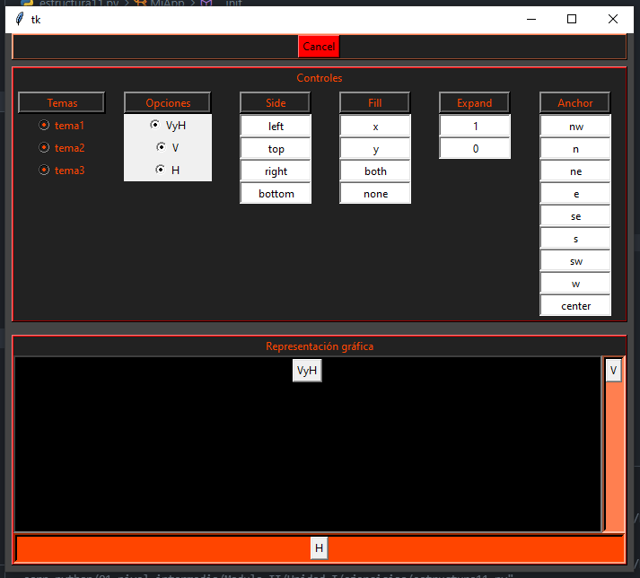


## ***Paso 12: Función cerrar aplicación - estructura12.py***

Tkinter permite capturar varios tipos de eventos, mediante el uso de bind(). En este script utilizamos bind() para hacer que la función callback se ejectute cuando presionamos en el botón izquierdo del mouse "<Button-1>"

``estructura12.py``

```python
from tkinter import *


class MiApp:
    def __init__(self, parent=None, **configs):

        # ##################################################################
        # Defino parámetros
        # ##################################################################
        ancho_boton = 10

        # ##################################################################
        # Defino variables por defecto
        # ##################################################################
        self.temas = StringVar()
        self.temas.set("tema1")

        self.nombres = StringVar()
        self.nombres.set("VyH")

        self.side_option = StringVar()
        self.side_option.set(LEFT)

        self.fill_option = StringVar()
        self.fill_option.set(NONE)

        self.expand_option = StringVar()
        self.expand_option.set(YES)

        self.anchor_option = StringVar()
        self.anchor_option.set(N)

        # Agrego variables de contorl para eleccion de tema
        self.tema_option = IntVar(value=0)

        # ##################################################################
        # Ventana principal
        # ##################################################################
        self.my_parent = parent
        self.my_parent.geometry("700x600")

        # ##################################################################
        # Agrego contenedor
        # ##################################################################
        self.contenedor = Frame(self.my_parent, bg="#444")
        self.contenedor.pack(expand=YES, fill=BOTH)
        # ##################################################################
        # Agrego Secciones Principales
        # ##################################################################
        #####  CERRAR #####
        self.seccion_cerrar = Frame(
            self.contenedor, bg="#FF7F50", height=22, borderwidth=2, relief=RAISED
        )
        self.seccion_cerrar.pack(side=TOP, expand=NO, fill=X, padx=7)
        self.cerrar = Frame(self.seccion_cerrar, bg="#222", height=22)
        self.cerrar.pack(side=TOP, expand=NO, fill=X)

        #####  SECCIÓN CONTROLES #####
        self.seccion_controles = Frame(
            self.contenedor, bg="red", borderwidth=2, relief=RAISED
        )
        self.seccion_controles.pack(side=TOP, expand=NO, fill=BOTH, padx=7, pady=7)
        titulo_controles = "Controles"
        Label(
            self.seccion_controles,
            text=titulo_controles,
            bg="#222",
            fg="OrangeRed",
            justify=LEFT,
        ).pack(side=TOP, expand=NO, fill=X, anchor=W)
        self.controles = Frame(self.seccion_controles, bg="#222")
        self.controles.pack(side=TOP, expand=NO, fill=X)

        #####  SECCIÓN REPRESENTACIÓN #####
        self.seccion_representacion = Frame(
            self.contenedor, bg="red", borderwidth=2, relief=RAISED
        )
        self.seccion_representacion.pack(
            side=BOTTOM, expand=YES, fill=BOTH, padx=7, pady=7
        )
        titulo_grafico = "Representación gráfica"
        Label(
            self.seccion_representacion,
            text=titulo_grafico,
            bg="#222",
            fg="OrangeRed",
            justify=LEFT,
        ).pack(side=TOP, expand=NO, fill=X, anchor=W)
        self.representacion = Frame(self.seccion_representacion, bg="OrangeRed")
        self.representacion.pack(side=TOP, expand=YES, fill=BOTH)
        # ##################################################################
        # Controles
        # ##################################################################
        self.temas_opciones = Frame(self.controles, borderwidth=5, bg="#222")
        self.nombres_opciones = Frame(self.controles, borderwidth=5, bg="#222")
        self.side_contenedor = Frame(self.controles, borderwidth=5, bg="#222")
        self.fill_contenedor = Frame(self.controles, borderwidth=5, bg="#222")
        self.expand_contenedor = Frame(self.controles, borderwidth=5, bg="#222")
        self.anchor_contenedor = Frame(self.controles, borderwidth=5, bg="#222")

        self.temas_opciones.pack(side=LEFT, expand=NO, fill=Y, anchor=N)
        self.nombres_opciones.pack(side=LEFT, expand=YES, fill=Y, anchor=N)
        self.side_contenedor.pack(side=LEFT, expand=YES, anchor=N)
        self.fill_contenedor.pack(side=LEFT, expand=YES, anchor=N)
        self.expand_contenedor.pack(side=LEFT, expand=YES, anchor=N)
        self.anchor_contenedor.pack(side=LEFT, expand=YES, anchor=N)

        Label(
            self.temas_opciones,
            borderwidth=4,
            relief=RAISED,
            text="Temas",
            bg="#222",
            fg="OrangeRed",
        ).pack(fill=X)
        Label(
            self.nombres_opciones,
            borderwidth=4,
            relief=RAISED,
            text="Opciones",
            bg="#222",
            fg="OrangeRed",
        ).pack(fill=X)
        Label(
            self.side_contenedor,
            borderwidth=4,
            relief=RAISED,
            text="Side",
            bg="#222",
            fg="OrangeRed",
        ).pack(fill=X)
        Label(
            self.fill_contenedor,
            borderwidth=4,
            relief=RAISED,
            text="Fill",
            bg="#222",
            fg="OrangeRed",
        ).pack(fill=X)
        Label(
            self.expand_contenedor,
            borderwidth=4,
            relief=RAISED,
            text="Expand",
            bg="#222",
            fg="OrangeRed",
        ).pack(fill=X)
        Label(
            self.anchor_contenedor,
            borderwidth=4,
            relief=RAISED,
            text="Anchor",
            bg="#222",
            fg="OrangeRed",
        ).pack(fill=X)

        # ##################################################################
        # Representación
        # ##################################################################
        self.representacion_superior = Frame(self.representacion, bg="red")
        self.representacion_superior.pack(side=TOP, expand=YES, fill=BOTH)

        self.deslizador_central = Frame(
            self.representacion_superior,
            background="black",
            borderwidth=4,
            relief=SUNKEN,
            width=250,
        )
        self.deslizador_central.pack(side=LEFT, expand=YES, fill=BOTH)

        self.deslizador_vertical = Frame(
            self.representacion_superior,
            background="#FF7F50",
            borderwidth=4,
            relief=SUNKEN,
            width=50,
        )
        self.deslizador_vertical.pack(side=RIGHT, expand=NO, fill=Y)

        self.deslizador_horizontal = Frame(
            self.representacion, borderwidth=4, relief=SUNKEN, height=50, bg="OrangeRed"
        )
        self.deslizador_horizontal.pack(side=TOP, fill=X)
        # ##################################################################
        # Texto de botones parte gráfica
        # ##################################################################

        self.botonVyH = Button(self.deslizador_central, text="VyH")
        self.botonVyH.pack()
        self.botonV = Button(self.deslizador_vertical, text="V")
        self.botonV.pack()
        self.botonH = Button(self.deslizador_horizontal, text="H")
        self.botonH.pack()
        self.elegir_nombre_botones = {
            "VyH": self.botonVyH,
            "V": self.botonV,
            "H": self.botonH,
        }

        # ##################################################################
        # Nombres en controles
        # ##################################################################
        temas = ["tema1", "tema2", "tema3"]
        nombres = ["VyH", "V", "H"]
        side_options = [LEFT, TOP, RIGHT, BOTTOM]
        fill_options = [X, Y, BOTH, NONE]
        expand_options = [YES, NO]
        anchor_options = [NW, N, NE, E, SE, S, SW, W, CENTER]

        # Agrego opciones de colores para bg y fg
        self.bg_colors = ["#222", "blue", "OrangeRed"]

        # ##################################################################
        # Opciones de controles
        # ##################################################################

        for opcion in temas:
            boton = Radiobutton(
                self.temas_opciones,
                text=str(opcion),
                indicatoron=1,
                value=opcion,
                bg="#222",
                fg="OrangeRed",
            )
            boton["width"] = ancho_boton
            boton.pack(side=TOP)

        for opcion in nombres:
            boton = Radiobutton(self.nombres_opciones, text=str(opcion), indicatoron=1)
            boton["width"] = ancho_boton
            boton.pack(side=TOP)

        for opcion in side_options:
            boton = Radiobutton(self.side_contenedor, text=str(opcion), indicatoron=0)
            boton["width"] = ancho_boton
            boton.pack(side=TOP)

        for opcion in fill_options:
            boton = Radiobutton(self.fill_contenedor, text=str(opcion), indicatoron=0)
            boton["width"] = ancho_boton
            boton.pack(side=TOP)

        for opcion in expand_options:
            boton = Radiobutton(self.expand_contenedor, text=str(opcion), indicatoron=0)
            boton["width"] = ancho_boton
            boton.pack(side=TOP)

        for opcion in anchor_options:
            boton = Radiobutton(self.anchor_contenedor, text=str(opcion), indicatoron=0)
            boton["width"] = ancho_boton
            boton.pack(side=TOP)

        # ##################################################################
        # Botón de cancelar
        # ##################################################################
        self.cancelar = Button(self.cerrar, text="Cancel", background="red")
        self.cancelar.pack(side=BOTTOM, anchor=S)
        self.cancelar.bind("<Button-1>", self.cerrarApp)
        # ############################################################
        # Destruir

    # ############################################################
    def cerrarApp(self, event):
        self.my_parent.destroy()


if __name__ == "__main__":
    root = Tk()
    MiApp(root)
    root.mainloop()
```

## ***Paso 13: Función reseteo - estructura13.py***

ahora podemos utilizar los valores por defecto que ya hemos determinado, y crear un método "reseteo()" el cual al presionar en la opción de cambio de botón reseteee los valores a ese grupo de parámetros preestablecidos. Lo que debemos hacer es utilizar el atributo "variable" tanto para obtener el valor del botón de nombres como para setear el valor del resto de los parámetros.

Para recuperar un grupo de parámetros se utiliza ``pack_info()``.

Para obtener un valor usamos `get().`

para setearlo `set().`

`estructura13.py`

```python
from tkinter import *


class MiApp:
    def __init__(self, parent=None, **configs):

        # ##################################################################
        # Defino parámetros
        # ##################################################################
        ancho_boton = 10

        # ##################################################################
        # Defino variables por defecto
        # ##################################################################
        self.temas = StringVar()
        self.temas.set("tema1")

        self.nombres = StringVar()
        self.nombres.set("VyH")

        self.side_option = StringVar()
        self.side_option.set(LEFT)

        self.fill_option = StringVar()
        self.fill_option.set(NONE)

        self.expand_option = StringVar()
        self.expand_option.set(YES)

        self.anchor_option = StringVar()
        self.anchor_option.set(N)

        # Agrego variables de contorl para eleccion de tema
        self.tema_option = IntVar(value=0)

        # ##################################################################
        # Ventana principal
        # ##################################################################
        self.my_parent = parent
        self.my_parent.geometry("700x600")

        # ##################################################################
        # Agrego contenedor
        # ##################################################################
        self.contenedor = Frame(self.my_parent, bg="#444")
        self.contenedor.pack(expand=YES, fill=BOTH)
        # ##################################################################
        # Agrego Secciones Principales
        # ##################################################################
        #####  CERRAR #####
        self.seccion_cerrar = Frame(
            self.contenedor, bg="#FF7F50", height=22, borderwidth=2, relief=RAISED
        )
        self.seccion_cerrar.pack(side=TOP, expand=NO, fill=X, padx=7)
        self.cerrar = Frame(self.seccion_cerrar, bg="#222", height=22)
        self.cerrar.pack(side=TOP, expand=NO, fill=X)

        #####  SECCIÓN CONTROLES #####
        self.seccion_controles = Frame(
            self.contenedor, bg="red", borderwidth=2, relief=RAISED
        )
        self.seccion_controles.pack(side=TOP, expand=NO, fill=BOTH, padx=7, pady=7)
        titulo_controles = "Controles"
        Label(
            self.seccion_controles,
            text=titulo_controles,
            bg="#222",
            fg="OrangeRed",
            justify=LEFT,
        ).pack(side=TOP, expand=NO, fill=X, anchor=W)
        self.controles = Frame(self.seccion_controles, bg="#222")
        self.controles.pack(side=TOP, expand=NO, fill=X)

        #####  SECCIÓN REPRESENTACIÓN #####
        self.seccion_representacion = Frame(
            self.contenedor, bg="red", borderwidth=2, relief=RAISED
        )
        self.seccion_representacion.pack(
            side=BOTTOM, expand=YES, fill=BOTH, padx=7, pady=7
        )
        titulo_grafico = "Representación gráfica"
        Label(
            self.seccion_representacion,
            text=titulo_grafico,
            bg="#222",
            fg="OrangeRed",
            justify=LEFT,
        ).pack(side=TOP, expand=NO, fill=X, anchor=W)
        self.representacion = Frame(self.seccion_representacion, bg="OrangeRed")
        self.representacion.pack(side=TOP, expand=YES, fill=BOTH)
        # ##################################################################
        # Controles
        # ##################################################################
        self.temas_opciones = Frame(self.controles, borderwidth=5, bg="#222")
        self.nombres_opciones = Frame(self.controles, borderwidth=5, bg="#222")
        self.side_contenedor = Frame(self.controles, borderwidth=5, bg="#222")
        self.fill_contenedor = Frame(self.controles, borderwidth=5, bg="#222")
        self.expand_contenedor = Frame(self.controles, borderwidth=5, bg="#222")
        self.anchor_contenedor = Frame(self.controles, borderwidth=5, bg="#222")

        self.temas_opciones.pack(side=LEFT, expand=NO, fill=Y, anchor=N)
        self.nombres_opciones.pack(side=LEFT, expand=YES, fill=Y, anchor=N)
        self.side_contenedor.pack(side=LEFT, expand=YES, anchor=N)
        self.fill_contenedor.pack(side=LEFT, expand=YES, anchor=N)
        self.expand_contenedor.pack(side=LEFT, expand=YES, anchor=N)
        self.anchor_contenedor.pack(side=LEFT, expand=YES, anchor=N)

        Label(
            self.temas_opciones,
            borderwidth=4,
            relief=RAISED,
            text="Temas",
            bg="#222",
            fg="OrangeRed",
        ).pack(fill=X)
        Label(
            self.nombres_opciones,
            borderwidth=4,
            relief=RAISED,
            text="Opciones",
            bg="#222",
            fg="OrangeRed",
        ).pack(fill=X)
        Label(
            self.side_contenedor,
            borderwidth=4,
            relief=RAISED,
            text="Side",
            bg="#222",
            fg="OrangeRed",
        ).pack(fill=X)
        Label(
            self.fill_contenedor,
            borderwidth=4,
            relief=RAISED,
            text="Fill",
            bg="#222",
            fg="OrangeRed",
        ).pack(fill=X)
        Label(
            self.expand_contenedor,
            borderwidth=4,
            relief=RAISED,
            text="Expand",
            bg="#222",
            fg="OrangeRed",
        ).pack(fill=X)
        Label(
            self.anchor_contenedor,
            borderwidth=4,
            relief=RAISED,
            text="Anchor",
            bg="#222",
            fg="OrangeRed",
        ).pack(fill=X)

        # ##################################################################
        # Representación
        # ##################################################################
        self.representacion_superior = Frame(self.representacion, bg="red")
        self.representacion_superior.pack(side=TOP, expand=YES, fill=BOTH)

        self.deslizador_central = Frame(
            self.representacion_superior,
            background="black",
            borderwidth=4,
            relief=SUNKEN,
            width=250,
        )
        self.deslizador_central.pack(side=LEFT, expand=YES, fill=BOTH)

        self.deslizador_vertical = Frame(
            self.representacion_superior,
            background="#FF7F50",
            borderwidth=4,
            relief=SUNKEN,
            width=50,
        )
        self.deslizador_vertical.pack(side=RIGHT, expand=NO, fill=Y)

        self.deslizador_horizontal = Frame(
            self.representacion, borderwidth=4, relief=SUNKEN, height=50, bg="OrangeRed"
        )
        self.deslizador_horizontal.pack(side=TOP, fill=X)
        # ##################################################################
        # Texto de botones parte gráfica
        # ##################################################################

        self.botonVyH = Button(self.deslizador_central, text="VyH")
        self.botonVyH.pack()
        self.botonV = Button(self.deslizador_vertical, text="V")
        self.botonV.pack()
        self.botonH = Button(self.deslizador_horizontal, text="H")
        self.botonH.pack()
        self.elegir_nombre_botones = {
            "VyH": self.botonVyH,
            "V": self.botonV,
            "H": self.botonH,
        }

        # ##################################################################
        # Nombres en controles
        # ##################################################################
        temas = ["tema1", "tema2", "tema3"]
        nombres = ["VyH", "V", "H"]
        side_options = [LEFT, TOP, RIGHT, BOTTOM]
        fill_options = [X, Y, BOTH, NONE]
        expand_options = [YES, NO]
        anchor_options = [NW, N, NE, E, SE, S, SW, W, CENTER]

        # Agrego opciones de colores para bg y fg
        self.bg_colors = ["#222", "blue", "OrangeRed"]

        # ##################################################################
        # Opciones de controles
        # ##################################################################

        for opcion in temas:
            boton = Radiobutton(
                self.temas_opciones,
                text=str(opcion),
                indicatoron=0,
                value=int(opcion[-1]) - 1,
                variable=self.tema_option,
                bg="#222",
                fg="OrangeRed",
                command=self.bg_fg_option,
            )
            boton["width"] = ancho_boton
            boton.pack(side=TOP)

        for opcion in nombres:
            boton = Radiobutton(
                self.nombres_opciones,
                text=str(opcion),
                indicatoron=1,
                value=opcion,
                command=self.reseteo,
                variable=self.nombres,
            )
            boton["width"] = ancho_boton
            boton.pack(side=TOP)

        for opcion in side_options:
            boton = Radiobutton(
                self.side_contenedor,
                text=str(opcion),
                indicatoron=0,
                value=opcion,
                variable=self.side_option,
            )
            boton["width"] = ancho_boton
            boton.pack(side=TOP)

        for opcion in fill_options:
            boton = Radiobutton(
                self.fill_contenedor,
                text=str(opcion),
                indicatoron=0,
                value=opcion,
                variable=self.fill_option,
            )
            boton["width"] = ancho_boton
            boton.pack(side=TOP)

        for opcion in expand_options:
            boton = Radiobutton(
                self.expand_contenedor,
                text=str(opcion),
                indicatoron=0,
                value=opcion,
                variable=self.expand_option,
            )
            boton["width"] = ancho_boton
            boton.pack(side=TOP)

        for opcion in anchor_options:
            boton = Radiobutton(
                self.anchor_contenedor,
                text=str(opcion),
                indicatoron=0,
                value=opcion,
                variable=self.anchor_option,
            )
            boton["width"] = ancho_boton
            boton.pack(side=TOP)

        # ##################################################################
        # Botón de cancelar
        # ##################################################################
        self.cancelar = Button(self.cerrar, text="Cancel", background="red")
        self.cancelar.pack(side=BOTTOM, anchor=S)
        self.cancelar.bind("<Button-1>", self.cerrarApp)

    # ##################################################################
    # Destruir
    # ##################################################################
    def cerrarApp(self, event):
        self.my_parent.destroy()

    # ##################################################################
    # Defino función de reseteo
    # ##################################################################
    def reseteo(self):
        button = self.elegir_nombre_botones[self.nombres.get()]
        properties = button.pack_info()
        self.fill_option.set(properties["fill"])
        self.side_option.set(properties["side"])
        self.expand_option.set(properties["expand"])
        self.anchor_option.set(properties["anchor"])

    def bg_fg_option(self):
        self.cerrar["bg"] = self.bg_colors[self.tema_option.get()]
        self.controles["bg"] = self.bg_colors[self.tema_option.get()]
        self.temas_opciones["bg"] = self.bg_colors[self.tema_option.get()]
        self.nombres_opciones["bg"] = self.bg_colors[self.tema_option.get()]
        self.side_contenedor["bg"] = self.bg_colors[self.tema_option.get()]
        self.fill_contenedor["bg"] = self.bg_colors[self.tema_option.get()]
        self.expand_contenedor["bg"] = self.bg_colors[self.tema_option.get()]
        self.anchor_contenedor["bg"] = self.bg_colors[self.tema_option.get()]
        self.representacion["bg"] = self.bg_colors[self.tema_option.get()]
        self.representacion_superior["bg"] = self.bg_colors[self.tema_option.get()]
        self.deslizador_central["bg"] = self.bg_colors[self.tema_option.get()]
        self.deslizador_vertical["bg"] = self.bg_colors[self.tema_option.get()]
        self.deslizador_horizontal["bg"] = self.bg_colors[self.tema_option.get()]


if __name__ == "__main__":
    root = Tk()
    MiApp(root)
    root.mainloop()
```

La representación gráfica nos queda:

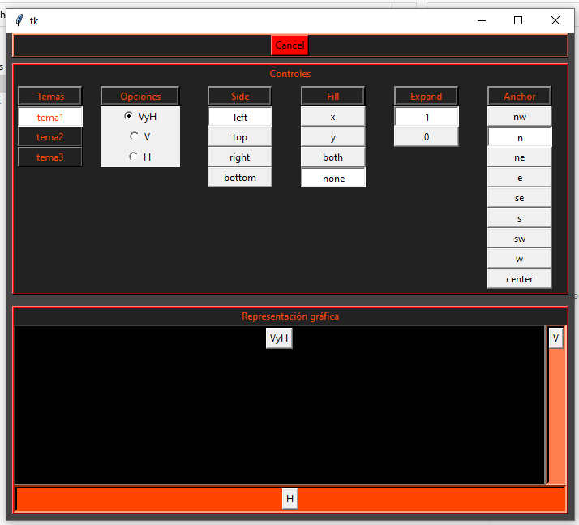

Paso 14: Función actualizar - estructura14.py

Para terminar, crearemos el método "actualiza()" para poder actualizar el conjunto de valores que se establecen por defecto asociados a cada botón al modificar los valores desde la interfaz gráfica.

`estructura14.py`

```python
from tkinter import *


class MiApp:
    def __init__(self, parent=None, **configs):

        # ##################################################################
        # Defino parámetros
        # ##################################################################
        ancho_boton = 10

        # ##################################################################
        # Defino variables por defecto
        # ##################################################################
        self.temas = StringVar()
        self.temas.set("tema1")

        self.nombres = StringVar()
        self.nombres.set("VyH")

        self.side_option = StringVar()
        self.side_option.set(LEFT)

        self.fill_option = StringVar()
        self.fill_option.set(NONE)

        self.expand_option = StringVar()
        self.expand_option.set(YES)

        self.anchor_option = StringVar()
        self.anchor_option.set(N)

        # Agrego variables de contorl para eleccion de tema
        self.tema_option = IntVar(value=0)

        # ##################################################################
        # Ventana principal
        # ##################################################################
        self.my_parent = parent
        self.my_parent.geometry("700x600")

        # ##################################################################
        # Agrego contenedor
        # ##################################################################
        self.contenedor = Frame(self.my_parent, bg="#444")
        self.contenedor.pack(expand=YES, fill=BOTH)
        # ##################################################################
        # Agrego Secciones Principales
        # ##################################################################
        #####  CERRAR #####
        self.seccion_cerrar = Frame(
            self.contenedor, bg="#FF7F50", height=22, borderwidth=2, relief=RAISED
        )
        self.seccion_cerrar.pack(side=TOP, expand=NO, fill=X, padx=7)
        self.cerrar = Frame(self.seccion_cerrar, bg="#222", height=22)
        self.cerrar.pack(side=TOP, expand=NO, fill=X)

        #####  SECCIÓN CONTROLES #####
        self.seccion_controles = Frame(
            self.contenedor, bg="red", borderwidth=2, relief=RAISED
        )
        self.seccion_controles.pack(side=TOP, expand=NO, fill=BOTH, padx=7, pady=7)
        titulo_controles = "Controles"
        Label(
            self.seccion_controles,
            text=titulo_controles,
            bg="#222",
            fg="OrangeRed",
            justify=LEFT,
        ).pack(side=TOP, expand=NO, fill=X, anchor=W)
        self.controles = Frame(self.seccion_controles, bg="#222")
        self.controles.pack(side=TOP, expand=NO, fill=X)

        #####  SECCIÓN REPRESENTACIÓN #####
        self.seccion_representacion = Frame(
            self.contenedor, bg="red", borderwidth=2, relief=RAISED
        )
        self.seccion_representacion.pack(
            side=BOTTOM, expand=YES, fill=BOTH, padx=7, pady=7
        )
        titulo_grafico = "Representación gráfica"
        Label(
            self.seccion_representacion,
            text=titulo_grafico,
            bg="#222",
            fg="OrangeRed",
            justify=LEFT,
        ).pack(side=TOP, expand=NO, fill=X, anchor=W)
        self.representacion = Frame(self.seccion_representacion, bg="OrangeRed")
        self.representacion.pack(side=TOP, expand=YES, fill=BOTH)
        # ##################################################################
        # Controles
        # ##################################################################
        self.temas_opciones = Frame(self.controles, borderwidth=5, bg="#222")
        self.nombres_opciones = Frame(self.controles, borderwidth=5, bg="#222")
        self.side_contenedor = Frame(self.controles, borderwidth=5, bg="#222")
        self.fill_contenedor = Frame(self.controles, borderwidth=5, bg="#222")
        self.expand_contenedor = Frame(self.controles, borderwidth=5, bg="#222")
        self.anchor_contenedor = Frame(self.controles, borderwidth=5, bg="#222")

        self.temas_opciones.pack(side=LEFT, expand=NO, fill=Y, anchor=N)
        self.nombres_opciones.pack(side=LEFT, expand=YES, fill=Y, anchor=N)
        self.side_contenedor.pack(side=LEFT, expand=YES, anchor=N)
        self.fill_contenedor.pack(side=LEFT, expand=YES, anchor=N)
        self.expand_contenedor.pack(side=LEFT, expand=YES, anchor=N)
        self.anchor_contenedor.pack(side=LEFT, expand=YES, anchor=N)

        Label(
            self.temas_opciones,
            borderwidth=4,
            relief=RAISED,
            text="Temas",
            bg="#222",
            fg="OrangeRed",
        ).pack(fill=X)
        Label(
            self.nombres_opciones,
            borderwidth=4,
            relief=RAISED,
            text="Opciones",
            bg="#222",
            fg="OrangeRed",
        ).pack(fill=X)
        Label(
            self.side_contenedor,
            borderwidth=4,
            relief=RAISED,
            text="Side",
            bg="#222",
            fg="OrangeRed",
        ).pack(fill=X)
        Label(
            self.fill_contenedor,
            borderwidth=4,
            relief=RAISED,
            text="Fill",
            bg="#222",
            fg="OrangeRed",
        ).pack(fill=X)
        Label(
            self.expand_contenedor,
            borderwidth=4,
            relief=RAISED,
            text="Expand",
            bg="#222",
            fg="OrangeRed",
        ).pack(fill=X)
        Label(
            self.anchor_contenedor,
            borderwidth=4,
            relief=RAISED,
            text="Anchor",
            bg="#222",
            fg="OrangeRed",
        ).pack(fill=X)

        # ##################################################################
        # Representación
        # ##################################################################
        self.representacion_superior = Frame(self.representacion, bg="red")
        self.representacion_superior.pack(side=TOP, expand=YES, fill=BOTH)

        self.deslizador_central = Frame(
            self.representacion_superior,
            background="black",
            borderwidth=4,
            relief=SUNKEN,
            width=250,
        )
        self.deslizador_central.pack(side=LEFT, expand=YES, fill=BOTH)

        self.deslizador_vertical = Frame(
            self.representacion_superior,
            background="#FF7F50",
            borderwidth=4,
            relief=SUNKEN,
            width=50,
        )
        self.deslizador_vertical.pack(side=RIGHT, expand=NO, fill=Y)

        self.deslizador_horizontal = Frame(
            self.representacion, borderwidth=4, relief=SUNKEN, height=50, bg="OrangeRed"
        )
        self.deslizador_horizontal.pack(side=TOP, fill=X)
        # ##################################################################
        # Texto de botones parte gráfica
        # ##################################################################

        self.botonVyH = Button(self.deslizador_central, text="VyH")
        self.botonVyH.pack()
        self.botonV = Button(self.deslizador_vertical, text="V")
        self.botonV.pack()
        self.botonH = Button(self.deslizador_horizontal, text="H")
        self.botonH.pack()
        self.elegir_nombre_botones = {
            "VyH": self.botonVyH,
            "V": self.botonV,
            "H": self.botonH,
        }

        # ##################################################################
        # Nombres en controles
        # ##################################################################
        temas = ["tema1", "tema2", "tema3"]
        nombres = ["VyH", "V", "H"]
        side_options = [LEFT, TOP, RIGHT, BOTTOM]
        fill_options = [X, Y, BOTH, NONE]
        expand_options = [YES, NO]
        anchor_options = [NW, N, NE, E, SE, S, SW, W, CENTER]

        # Agrego opciones de colores para bg y fg
        self.bg_colors = ["#222", "blue", "OrangeRed"]

        # ##################################################################
        # Opciones de controles
        # ##################################################################

        for opcion in temas:
            boton = Radiobutton(
                self.temas_opciones,
                text=str(opcion),
                indicatoron=0,
                value=int(opcion[-1]) - 1,
                variable=self.tema_option,
                bg="#222",
                fg="OrangeRed",
                command=self.bg_fg_option,
            )
            boton["width"] = ancho_boton
            boton.pack(side=TOP)

        for opcion in nombres:
            boton = Radiobutton(
                self.nombres_opciones,
                text=str(opcion),
                indicatoron=1,
                value=opcion,
                command=self.reseteo,
                variable=self.nombres,
            )
            boton["width"] = ancho_boton
            boton.pack(side=TOP)

        for opcion in side_options:
            boton = Radiobutton(
                self.side_contenedor,
                text=str(opcion),
                indicatoron=0,
                value=opcion,
                command=self.actualizar,
                variable=self.side_option,
            )
            boton["width"] = ancho_boton
            boton.pack(side=TOP)

        for opcion in fill_options:
            boton = Radiobutton(
                self.fill_contenedor,
                text=str(opcion),
                indicatoron=0,
                value=opcion,
                command=self.actualizar,
                variable=self.fill_option,
            )
            boton["width"] = ancho_boton
            boton.pack(side=TOP)

        for opcion in expand_options:
            boton = Radiobutton(
                self.expand_contenedor,
                text=str(opcion),
                indicatoron=0,
                value=opcion,
                command=self.actualizar,
                variable=self.expand_option,
            )
            boton["width"] = ancho_boton
            boton.pack(side=TOP)

        for opcion in anchor_options:
            boton = Radiobutton(
                self.anchor_contenedor,
                text=str(opcion),
                indicatoron=0,
                value=opcion,
                command=self.actualizar,
                variable=self.anchor_option,
            )
            boton["width"] = ancho_boton
            boton.pack(side=TOP)

        # ##################################################################
        # Botón de cancelar
        # ##################################################################
        self.cancelar = Button(self.cerrar, text="Cancel", background="red")
        self.cancelar.pack(side=BOTTOM, anchor=S)
        self.cancelar.bind("<Button-1>", self.cerrarApp)

    # ##################################################################
    # Destruir
    # ##################################################################
    def cerrarApp(self, event):
        self.my_parent.destroy()

    # ##################################################################
    # Defino función de reseteo
    # ##################################################################
    def reseteo(self):
        button = self.elegir_nombre_botones[self.nombres.get()]
        properties = button.pack_info()
        self.fill_option.set(properties["fill"])
        self.side_option.set(properties["side"])
        self.expand_option.set(properties["expand"])
        self.anchor_option.set(properties["anchor"])

    # ##################################################################
    # Defino función actualizar
    # ##################################################################
    def actualizar(self):
        button = self.elegir_nombre_botones[self.nombres.get()]
        button.pack(
            fill=self.fill_option.get(),
            side=self.side_option.get(),
            expand=self.expand_option.get(),
            anchor=self.anchor_option.get(),
        )

    def bg_fg_option(self):
        self.cerrar["bg"] = self.bg_colors[self.tema_option.get()]
        self.controles["bg"] = self.bg_colors[self.tema_option.get()]
        self.temas_opciones["bg"] = self.bg_colors[self.tema_option.get()]
        self.nombres_opciones["bg"] = self.bg_colors[self.tema_option.get()]
        self.side_contenedor["bg"] = self.bg_colors[self.tema_option.get()]
        self.fill_contenedor["bg"] = self.bg_colors[self.tema_option.get()]
        self.expand_contenedor["bg"] = self.bg_colors[self.tema_option.get()]
        self.anchor_contenedor["bg"] = self.bg_colors[self.tema_option.get()]
        self.representacion["bg"] = self.bg_colors[self.tema_option.get()]
        self.representacion_superior["bg"] = self.bg_colors[self.tema_option.get()]
        self.deslizador_central["bg"] = self.bg_colors[self.tema_option.get()]
        self.deslizador_vertical["bg"] = self.bg_colors[self.tema_option.get()]
        self.deslizador_horizontal["bg"] = self.bg_colors[self.tema_option.get()]


if __name__ == "__main__":
    root = Tk()
    MiApp(root)
    root.mainloop()
```

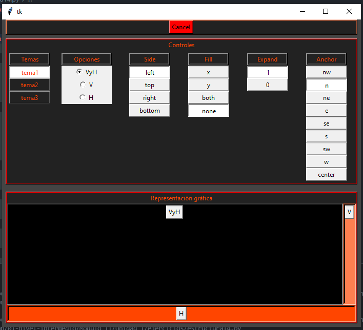


Bibliografía utilizada y sugerida    
Programming Python 5th Edition – Mark Lutz – O'Reilly 2013  
Programming Python 4th Edition – Mark Lutz – O'Reilly 2011  
https://docs.python.org/3.7/tutorial/ 
https://docs.python.org/3.7/library/index.html
