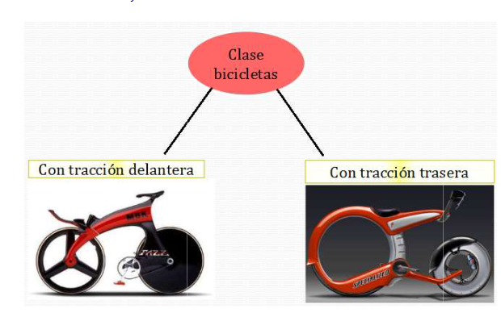

# Unidad III – POO - Programación Orientada a Objetos I

Tematicas

1. Introduccion a POO
2. La clase object.
3. Metodo __init__  ().
4. Herencia múltiple.
5. Uso de super.

**1- Introducción a POO**

La programación orientada a objetos (POO) es un paradigma de programación introducido en la década del 90 que facilita y simplifica el diseño de una aplicacion o programa. Posee varias ventajas con la relación a la programación estructurada, entre las que se destaca la posibilidad de reutilización de código, sin embargo la velocidad de ejecución puede verse disminuida por lo que en aplicaciones de cálculo numérico es necesario analizar la conveniencia o no de su uso, en este caso particular un mix entre programación estructurada y POO podría ser lo más recomendable.

Este tipo de programación se basa en cuatro técnicas principales, sin contar la herencia de la cual trataremos mas adelante, y son:

- abstracción.
- polimorfismo.
- acoplamiento (principio de ocultación).
- encapsulamiento.

La POO fue introducida para permitirnos programar de forma similar a como interacciones con el mundo que nos rodea, comprendiendo  a cada parte del código como si fuera un objeto, por lo que su utilización,(salvada la barrera de aprender nuevas estructuras de programación) debería ser mas intuitiva.

**¿Cómo pensar en objetos?**

Pensar en términos de objetos es muy parecido a como lo haríamor en la vida real. Por ejemplo vamos a pensar en un coche para tratar de modelizarlo en un esquema de POO. Diríamos que el coche es el elmento principal que tiene una serie de caracteríscas, como podrían ser el color, el modelo o la marca. Además tiene una serie de funcionalidades asociadas, como pueden ser ponerse en marcha, parar o estacionar. Pues en un esquema POO el coche seria el objeto, las propiedades (atributo o variable) serían las funcionalidades asociadas como ponerse en marcha o parar.

Vale aclarar, que los objetos son unicos, no existen dos objetos iguales, de la misma forma que no existen dos personas iguales, por más que sean mellizos o en el mundo de hoy, un clon, cada objeto es único.

 **¿Qué es una clase?**

La POO está formada básicamente por clases, estas estructuras, que vamos a utilizar para agrupar los atributos y métodos de un determinado tipo de objero, nos van a permitir definir al mismo. Cuando programamos un objeto y definimos sus características y funcionalidades en realidad lo que estamos haciendo es programar una clase.

**¿Cómo definimos una clase en Python?**

Vallamos paso a pasom comencemos por mostrar un ejemplo de declaración de clase:

```python
class PrimerClase:
    atributo1 = 2
objeto = PrimerClase()

print(objeto.atributo1)
```

Como vemos podemos indicar los siguientes componentes de la clase:

- Palabra reservada al inicio "class".
- Nombre de la clase "PrimeraClase".
- Dos puntos ":".

A continuación para crear un objeto de dicha clase se llama a la clase de forma similar a como llamaríamos a una funcíon, es decir por su nombre seguido de paréntesis:

```python
objeto = PrimerClase()
```

Para poder acceder al atributo definido dentro de la clase lo podemos hacer mediante lo que se denomina notación de punto, es decir escribir el nombre del objeto, luego un punto y luego el atributo al cual hacemos referencia:

```python
objeto.atributo1
```

**Herencia**

Las clases no están aisladas, sino que se relacionan entre sí, formando una jerarquía de clasificación. Los objetos heredan las propiedades y el comportamiento de todas las clases a las que pertenecen.

Podemos considerar que una relación entre superclases y subclases. Las subclases heredan atributos y operaciones de las superclases. Esto nos permite escribir una sola vez determinadas operaciones y aplicarselas a distintas subclases.

Consideremos como en la imagen siguiente una superclase "bicicletas" y dos subclases  "Con Traccion Trasera" y "Con Traccion Trasera"



Por ejemplo ambas subclases podrian heredar de la clase bicicletas, el método (las funciones escritas dentro de una clase denominan métodos ) frenar.

Veamos un ejemplo de como escribir una herencia en python.

```python
class ClasePadre1:
    atributo1 = 2
class ClasePadre2:
    atributo2 = 3

class ClaseHija(ClasePadre1, ClasePadre2):
    atributo3 = 4
    
    def imprimir(self, nombre):
        self.nombre = nombre
        print(self.nombre)
        
objeto = ClaseHija()
print(objeto.atributo1)
print(objeto.atributo2)
print(objeto.atributo3)
objeto.imprimir('juan')
```

Como podemos observar, Python permite la herencia multiple, en el ejemplo anterior la "ClaseHija" posee dos superclases o clases padre. Podemos observar que el objeto creado puede tener acceso a los atributos de sus superclases (tambien de sus métodos).

Hemos agregado también un método (función) dentro de la clase hija "imprimir()" que tiene definida una variable "nombre", notemos que tenemos acceso al método de forma similar al atributo mediante la notación de punto.

**Nota:** Luego estaremos en detalle en la forma correcta de escribir los métodos y las variables de clase, por ahora notemos el uso de self, la cual debe estar presente cada vez que se recibe una variable.

**Abstracción** 

Cada objeto en el sistema sirve como modelo de un "agente" abstracto que puede realizar trabajo informar y cambiar su estado y "comunicarse" con otros objetos en el sistema sin revelar como se implementan estas caracteristicas.

La abstracción expresa las características esenciales de un objeto, que permite la diferenciación entre estos.

Si aplicamos la característica de abstracción a los autos:

1. El objeto sería un auto.
2. Las propiedades sería su color, marca, etc.
3. Los métodos serían arrancar, parar, ...

**Encapsulamiento**

Significa reunir todos los elementos que pueden considerarse pertenecientes a una misma entidad, al mismo nivel de abstracción. Esto permite aumentar la cohesión de los componentes del sistema. Algunos autores confunden este concepto con el principio de ocultación, principalmente porque se suelen emplear conjuntamente(1*).

**Principio de Ocultamiento - Acoplamiento** 

Cada objeto está aislado del exterior, es un módulo natural, y cada tipo de objeto expone una interfaz a otros objetos que especifica cómo pueden interactuar con los objetos de la clase. El aislamiento protege a las propiedades de un objeto contra su modificación por quien no tenga derecho a acceder a ellas; solamente los propios métodos internos del objeto pueden acceder a su estado. Esto asegura que otros objetos no puedan cambiar el estado interno de un objeto de manera inesperada, eliminando efectos secundarios e interacciones inesperadas. Algunos lenguajes relajan esto, permitiendo un acceso directo a los datos internos del objeto de una manera controlada y limitando el grado de abstracción. La aplicación entera se reduce a un agregado o rompecabezas de objetos(1*).

Este punto introduce una diferencia sustancialmente importante entre Python y otros programas como PHP, JAVA, C++, etc.

En lo que se trata de la visibilidad de atributos y métodos, en Python no es posible declararlos como privados, protegidos o públicos, sino que son todos públicos. Los desarrolladores de Python han considerado que el programador en base a una buena documentación, asignación de nombres y estructura de trabajo se puede encargar de que los métodos y atributos no estén accesibles para el usuario común. La declaracíon de un atributo o método privado, mas que para impedir el acceso a los datos por un hacker, se han establecido para que por error no modifiquemos datos sensibles a nuestros programas.

En python lo que existe es la utilización de un doble guión bajo previo al nombre de un atributo o método (pero que no pueden finalizar con un doble guión bajo ya que estos están reservados en Python). Por convención el doble guión bajo el inicio indica que el atributo o método no puede ser llamado directamente y que se trata de un dato que no debe ser modificado por error, sin embargo si  puede ser accedido si así lo quisiéramo.

**privado.py**

```python
class AccesoPrivado(object):

def__privado(self):
    print("Metodo privado")
    
def getPrivado(self):
    self__privado()
    
objeto = AccesoPrivado()
objeto.getPrivado()
objeto.__AccesoPrivado__privado()
```

Dada la clase "AccesoPrivado" que hereda de la clase object (en realidad todas las clases en python heredan de la clase object aún cuando no lo especifique explicitamente), se considera un método __privado(), el cual si intentamos acceder desde fuera mediante:

```python
objeto.__privado()
```

Nos retorna un error.

Hasta aquí uno (sobre todo los que vienen de lenguajes como JAVA y PHP en donde se declaran métodos y variables privadas mediante la palabra reservada "private") podría pensar que el método es privado y que por eso no puedo accederlo desde fuera, con lo cual para poder acceder a su contenido, debo crear un función pública "getPrivado()" y accederlo a través de esta (esta en una práctica común en otros lenguajes), sin embargo en Python no se puede declarar un método o variable como privado y es posible accederlo como:

```python
objeto._AccesoPrivado__privado()
```

Anteponiendo el nombre de la clase, precedido de un guión bajo.

En realidad la declaración  de métodos y variables privados, no se establece para evitar que un Hacker experimentado acceda a determinadas variables o métodos, sino que se utiliza para que no modifiquemos datos sensibles por error al crear el codigo, ni lo pueda hacer el usuario de la API sin querer, por eso cuando indicamos un método o variable con el doble guión bajo, lo que estamos diciendo es "ojo, mira que lo que vas a modificar el creador del script lo considero sensible de ser modificado". Existen formas que veremos posteriormente de que al importar un paquete estos métodos o variables no se encuentren disponivles a no ser que se conozca su nombre, pero esto lo veremos más adelante.

**Polimorfismo**

Comportamientos diferentes, asociados a objetos distintos, pueden compartir el mismo nombre; al llamarlos por ese nombre se utilizará el comportamiento correspondiente al objeto que se esté  usando. O, dicho de otro modo , las referencias y las colecciones de objetos pueden contenet objetos de diferentes tipos,m y la invocación de un comportamiento en una referencia producirá el comportamiento correcto para el tipo real del objeto referenciado(1*).

Pasemos a ver un ejemplo:

**polimorfismo.py**

```python
class ClasePadre1:
    atributo1 = 2
    
    def imprimir(self, nombre):
        self.nombre=nombre
        print("Este es un nombre:"+ self.nombre)
        
class ClaseHija(ClasePadre1):
    atributo2 = 4
    
    def imprimir(self, nombre):
        self.nombre=nombre
        print(self.nombre)
        
objeto1 = ClasePadre1()
print(objeto1.atributo1)
objeto1.imprimir('Juan')
objeto2 = ClaseHija()
print(objeto2.atributo1)
print(objeto2.atributo2)
```

En este caso, tanto en la clase padre como en la clase hija se encuentran definidos los métodos "imprimir()", sin embargo vemos que son diferentes  y que cuando creamos y objeto de la clase hija, el método imprimir() que se ejecuta, pisa al método definido en la clase padre.

la salida del script anterior da:

------------

**1. La clase object**

Cada clase definida en Python hereda de la clase "object" , por lo que puede utilizar los métodos establecidos en dicha clase.

supongamos la siguiente clase, en el cual lo unico que se encuentra definido es un valor de variable c1:

```python
class Auto:
    color = "azul"
    
objeto = Auto()
print(objeto.color)

print(dir(Auto))
input()
```

Salida:

----------------------

Podemos ver dos cosas interesantes, la primera es la definición de un objeto de la clase "Auto" y la impresion del valor de "color" mediante el método print. En este caso la inicialización se está realizando a través del método `__init__` de la clase "object".

Lo segundo es que al utilizar el método dir() vemos que existen varios métodos asociados a "Auto" que nos hemos definido, dichos métodos que comienzan y terminan con un doble guión bajo, son métodos de la clase object, que se encuentran asociados implícitamente a la clase Auto.

**Nota:** De hecho, podemos ver con el agregado del siguiente código, que la clase Auto tiene como clase padre o superclase a la clase "object", y que en si es un objeto de la clase "type".

```python
class Auto:
    color = "azul"
#Instanciamos e imprimimos el objeto de la clase Auto
objeto = Auto()
print(objeto.color)
#Imprimimos los métodos de la clase Auto
print(dir(Auto))
#Vemos cual es su clase padre
print(Auto.__class__.__base__)
#Vemos si es un objeto de alguna clase
print(Auto__class__)
input()
```


Salida:

----------

**2. Método `__init__`()**

Cuando trabajamos con programación orientada a objetos POO, una de las cosas más importantes a tener en cuenta, es la forma en que creamos dichos objetos. Como veremos un poco más adelante la forma correcta de crear objetos es mediante la utilización de un método (función) `__init__` el cual es un método reservado de Python que cumple la función de contructor de la clase a la cual se encuentra asociada, es decir una función de constructor de la clase a la cual se encuentra asociada, es decir una función destinada a inicializar (crear) los objetos de la clase utilizada.

la funcion `__init__` puede tomar diferente tipo de argumentos, y para su correcta utilización, debemos comprender como vimos, que cada clase de Python hereda en forma implícita de la clase "object", es decir que "object" es una superclase de cada clase definida en Python. si no implementamos un método `__init__` en nuestra clase, por defecto se ejecuta el método `__init__` de la clase object.

Es posible, aunque no es la forma correcta crear variables de instancia sin utilizar un constructor como ejemplo veamos el siguiente caso en donde podemos ver que para trabajar con variables de instancia se utiliza dentro de la clase la palabra clace "self".

**init1.py**

```python
class Comentario:
    def imprimir(self):
        print(self.texto)
        
objeto = Comentario()
objeto.texto = "Hola variable de instancia"
objeto.imprimir()
input()
```

**3. Herencia múltiple**

Python soporta herencia múltiple, es decir que una clase puede heredar de más de una clase, para indicarlo, lo unico que tenemos que hacer es separar mediante una coma cada una de las clases de las cuales se hereda en la definición de la clase. Así podríamos tener la clase "Comentario" que tiene "N" superclases de la siguiente forma.

```python
class Comentario(Superclase1, Superclase2,......,SuperclaseN):
def imprimir(self)
print(self.texto)
```

Al trabajar con herencia múltiples, debemos tener mucho cuidado, para no cometer errores, ya que si dos superclases poseen el mismo nombre de método en su definición, ¿ de cuál de las dos hereda el método la clase hija ?.

Estas cuestiones las iremos resolviendo con ejemplos y al estudiar el uso de **"super"**, ahora nos ocuparemos de un problema denominado **"problamente del diamante"** el cual se da cuando una clase tiene dos superclases, las cuales tiene una superclase en común. Veamos el siguiente esquema, de tres niveles, en donde la Clase3 hereda de la Clase2a y Clase2b en donde estas dos últimas a su vez heredan de la Clase1:


Supongamos ahora que generamos una instacia de la Clase3 e implementamos un método declaro en la Clase1, ¿ La herencia se lleva a cabo a través de la rama que contiene a Clase2a o la que contiene la Clase2b ?

Python toma la convención de crear una lista de clase que:

1- Busca de izquierda a derecha, y de abajo hacia arriba.

Clase3, Clase2a Clase1, Clase2b Clase1

2- Se eliminan todas las apariciones repetidas de una clase salvo la última.

Clase3, Clase2a Clase1, Clase2b Clase1

queda: Clase3, Clase2a Clase2b, Clase1

Esto lo podemos ver si utilizamos el método reservado `__mro__`, veamoslo en el siguiente ejemplo:

**herenciaMultiple.py**

```python
class Clase1():
    def tipo(self):
        print("Soy clase1")
        
class Clase2a(Clase1):
    def tipo(self):
        print("Soy clase2a")

class Clase2b(Clase1):
    def tipo(self):
        print("Soy clase2b")
        
class Clase3(Clase2a, Clase2b):
    def tipo(self):
        print("Soy clase3")
        
print(Clase3.__mro__)        
```

Como era esperar la salida nos retorna: